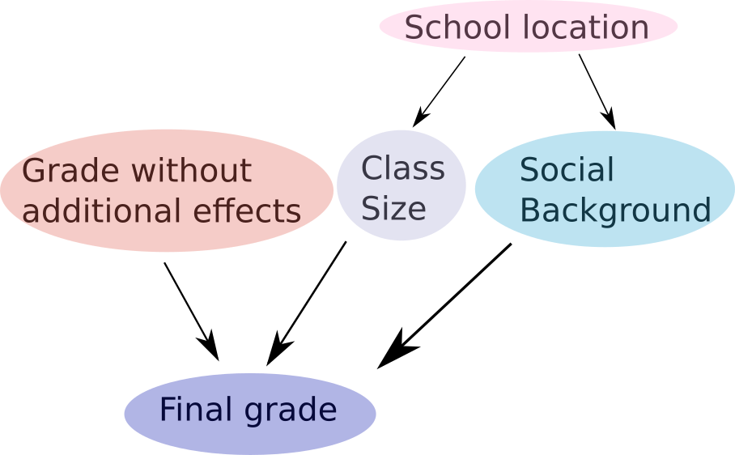

Installation
============

If you prefer to work on the source, clone the repository
::

   git clone https://github.com/eth-cscs/abcpy.git

Make sure all requirements are installed
::
   
   cd abcpy
   pip3 install -r requirements.txt

To create a package and install it do
::

   make package
   pip3 install build/dist/abcpy-0.1-py3-none-any.whl

Note that ABCpy requires Python3.

What's new?
===========

It is now possible to implement bayesian networks in ABCpy. If you are new to bayesian networks, check the section `Bayesian networks - an introduction`_.

In this section, we will introduce the various new features for this version of ABCpy.

Random variables and hierarchical models
~~~~~~~~~~~~~~~~~~~~~~~~~~~~~~~~~~~~~~~~

In short, the following is now possible:

::

    parameter = Normal([[1],[0.1]])
    model = Normal([parametere, [0.2]])

Check out `Using random variables`_ for an example of how to implement things discussed in this section.

In ABCpy, a :py:class:`abcpy.probabilisticmodels.ProbabilisticModel` object represents a *node* in our network, a random variable. This includes the models that model our observed data. The part of the graph that isn't a model is usually called the *prior*.

Since there are many properties associated with these objects, we did not simply call them random variable or distribution. For you to perform inference on some data, it is not necessary to understand these properties. If you are interested in implementing either your own distributions or other models, please check the `Implementing a new Model`_ section  below.

The way a bayesian network is now built within ABCpy is the following: each :py:class:`abcpy.probabilisticmodels.ProbabilisticModel` object has some input parameters. Each of these parameters can either be a 'fixed' and known to the user, for bayesian networks often called hyperparameter, or another random variable. Behind the scene, ABCpy will ensure that the graph structure is implemented and that inference will be performed on the whole construct.

Since each node of our graph can be a random variable, it does, in general, not have one fixed value. However, to perform inference, we of course need to sample values from the random variables, and use those to simulate data. These sampled values we will usually call parameter values. These values are what you will get as an end result of the inference.

An important thing to keep in mind: random variables are initialized without sampling values from them immediately. This works for inference algorithms, since these algorithms will contain a statement that samples from the prior first. However, if you want to implement a graph and then sample from the root model, or any other model within the graph structure, the necessary parameter values will not yet be defined. Therefore, if you want to have a 'stand-alone' distribution or model, you will need to call the method `sample_parameters()` for any parameter in the graph, which is best done right after initializing the relevant parameters. Only after this step is performed can you call the `sample_from_distribution()` method to obtain samples from the distribution.

Some words on performance: all operations on this graph structure are performed using recursion. This will, in general, slow down your code compared to previous versions of ABCpy, even if the prior information you give is the exact same as before. However, this will not affect the time inference needs to complete for most use cases, where you define your own hierarchical model. This is due to the fact that simulation is usually a lot slower than traversing the graph. Even if you do not specify such a complicated model, your run time should still be acceptable, given that you do not implement large graphs. Due to the limitations of ABC regarding low dimensionality of your problem, this should, however, not be an issue.

Multiple hierarchical models
~~~~~~~~~~~~~~~~~~~~~~~~~~~~

Check out `Using multiple hierarchical models`_ for an example on how to implement things discussed in this section.

It is now also possible to define multiple models on which the inference acts. The graphs given for each hierarchical model can be connected to those of different models or they can be independent (however, it is not possible for a model to be input to another model within the same round of inference). Note though that of course, for each model the graph has to consist of only one weakly connected component. Otherwise, there is no way for the algorithm to know how to connect the information on different nodes to affect the model.

Operations
~~~~~~~~~~

In short, the following is now possible:

::

    parameter = MultivariateNormal([[1,2],[[0.1,0],[0,0.1]])
    model = 2*parameter[1]+parameter[0]

Check out `Using operations`_ for an example on how to implement things discussed in this section.

Not only can you now connect random variables through their input parameters, it is also possible to perform operations on these objects to produce new random variables. In short, this means that you can now perform the operations "+", "-", "*", "/" and "**" (the power operator in Python) on any two nodes of your graph, giving a new node. It is possible to perform these operations between two random variables or between random variables and general data types of Python (integer, float, and so on).

Please keep in mind that parameters defined via operations will not be included in your list of parameters in the journal file. However, all parameters that are part of the operation, and are not fixed, will be included, so you can easily perform the required operations on the final result to get these parameters, if necessary.

In addition to these operators, you can now also use the "[]" operator (the access operator in Python). This allows you to only use selected values from a multidimensional random variable sample as a parameter of a new random variable.

Perturbation kernels
~~~~~~~~~~~~~~~~~~~~

In short, this is now how you define kernels on different parameters:

::

    kernel = MultivariateNormalKernel([parameter_1, parameter_2])
    kernel_joint = JointPerturbationKernel([kernel])

Check out `Using perturbation kernels`_ for an example on how to implement things discussed in this section.

Since you can now define much more complicated priors, the kernels have changed accordingly. There are two classes, :py:class:`abcpy.perturbationkernel.ContinuousKernel` and :py:class:`abcpy.perturbationkernel.DiscreteKernel`. The only difference between these two is that the first class acts on continuous random variables (and, therefore, has a probability density function), while the second class acts on discrete random variables (and, therefore, has a probability mass function).

For each kernel you define, you can specify which random variables of the graph it should perturb. In the end, you join all kernels using an object of type :py:class:`abcpy.perturbationkernel.JointPerturbationKernel`. Note that you need to join your kernels, even if you only defined one kernel! This is due to the fact that the algorithm cannot know how many kernels you defined otherwise.

Each algorithm is provided with a default kernel. If you do not specify another kernel and pass it to the sampling object, it will automatically create its own kernel. It will perturb all continuous parameters using a multivariate normal and all discrete parameters using a random walk.

Please keep in mind that you can only perturb whole parameters. You cannot use the access operator to perturb one part of a random variable differently than another part of the same variable.

Getting Started
===============

Here, we explain how to use ABCpy to infer parameters of models, given some observed data sets.

If you are new to either inference in general, ABC or bayesian networks, we recommend you start with the `Using random variables`_ section. If you would like to see all features in action together, check out `Using perturbation kernels`_.

Using random variables
~~~~~~~~~~~~~~~~~~~~~~

As an example, let us consider a Gaussian model. We want to model the height of a grown up human, given the following set of measurements, which we call observation or observed data.

.. literalinclude:: ../../examples/backends/dummy/pmcabc_gaussian.py
    :language: python
    :lines: 5
    :dedent: 4

Now, we want to model the height of humans by a Gaussian or Normal model, which has two parameters: the mean, denoted by :math:`\mu`, and the standard deviation, denoted by :math:`\sigma`. The goal is to use ABC to infer these yet unknown parameters from the information contained in the observed data.

A pre-requisite for ABC is that we provide certain *prior* knowledge about the parameters which we want to infer. In our case, it is quite simple. We know from experience that the average height should be somewhere between 150cm and 200cm, while the standard deviation is around 5 to 25.

.. literalinclude:: ../../examples/backends/dummy/pmcabc_gaussian.py
    :language: python
    :lines: 8-10, 12-13
    :dedent: 4

Further, we need a means to quantify how close our observation is to synthetic
data (generated by the model). Often, the real and synthetic observations cannot be
compared directly in a reasonable or efficient way. Thus, *summary statistics*
are used to extract relevant properties from the observations, with the idea that
these statistics then compare.

.. literalinclude:: ../../examples/backends/dummy/pmcabc_gaussian.py
    :language: python
    :lines: 16-17
    :dedent: 4
	     
As a distance we chose the LogReg distance here. Note that in ABCpy distance
functions operate not on the observations, but on summary statistics.

.. literalinclude:: ../../examples/backends/dummy/pmcabc_gaussian.py
    :language: python
    :lines: 20-21
    :dedent: 4	    

We can now set up an inference scheme -- let us chose PMCABC as our inference
algorithm of choice. As a pre-requisit, it requires a perturbation kernel. For this, we need to specify all random variables that will be perturbed by a kernel. Here, we use the default kernel provided in ABCpy. This will perturb our continuous prior using a multivariate normal. If our prior were discrete, it would be perturbed using a random walk. Please refere to `Using perturbation kernels`_ to see a more involved example.

.. literalinclude:: ../../examples/backends/dummy/pmcabc_gaussian.py
    :language: python
    :lines: 24-25
    :dedent: 4

We also need to define a backend:

.. literalinclude:: ../../examples/backends/dummy/pmcabc_gaussian.py
    :language: python
    :lines: 29-30
    :dedent: 4

We instanciate a PMCABC object and pass the kernel and backend objects to the
constructor:

.. literalinclude:: ../../examples/backends/dummy/pmcabc_gaussian.py
    :language: python
    :lines: 33-34
    :dedent: 4	    

Note that the model is given as a list. This is due to the fact that in ABCpy, it is possible to have multiple hierarchical models associated with an overall prior, all giving separate data sets. To learn more, see the `Using multiple hierarchical models`_ section.

Finally, we need to parametrize and start the actual sampling:

.. literalinclude:: ../../examples/backends/dummy/pmcabc_gaussian.py
    :language: python
    :lines: 37-40
    :dedent: 4

Again, observe that the observations are passed as a list. This is again due to the possibility of having multiple models.
	     
With this the inference process is done and the probabilities of the inferred
parameters are stored in the journal object. See `Post Analysis`_ for further
information on extracting results.

The code currently uses the dummy backend `BackendDummy` which does not
parallelize the execution of the inference schemes, but is very handy quick
prototyping and testing.

The full source can be found in `examples/backends/dummy/pmcabc_gaussian.py`.

To execute the code you only need to run

::

   python3 pmcabc_gaussian.py

Using operations
~~~~~~~~~~~~~~~~

Since release XX.XX of ABCpy, it is possible to define more complicated priors than previously. This includes having operations between random variables to produce new random variables.

For this tutorial, we will consider the following network:

We are considering a school with different classes. Each class has some number of students. All students of the school take an exam and receive some grade. These grades are our observed data set:

.. literalinclude:: ../../examples/backends/dummy/pmcabc_operations.py
    :language: python
    :lines: 6
    :dedent: 4

We assume that these grades depend on several prior information: the grade a student would obtain if there were no bias, the size of the class a student is in, as well as the social background from which the student originates. The last two of these quantities can be described using some penalty score. Let's assume that the scores are both normally distributed with some mean and variance. However, they also both depend on the location of the school. In certain neighbourhoods, the class size might be larger, or the social background might differ.

We, therefore, have an additional parameter in our prior, specifying that the mean of these normal distributions will vary uniformly between two lower and upper bounds.

Finally, we can assume that the grade without any bias would be a normally distributed parameter around an average grade.

Let us define these quantities and dependencies in ABCpy:

.. literalinclude:: ../../examples/backends/dummy/pmcabc_operations.py
    :language: python
    :lines: 9-10, 13, 16, 19
    :dedent: 4

So, each student will receive some grade which is normally distributed, but this grade is distorted by the other priors defined. The model which we obtain for the grade of some student, hence, can be written as:

.. literalinclude:: ../../examples/backends/dummy/pmcabc_operations.py
    :language: python
    :lines: 22
    :dedent: 4

As in the `Using random variables`_ section, we now need to define a summary statistics to extract relevant properties of our data.

.. literalinclude:: ../../examples/backends/dummy/pmcabc_operations.py
    :language: python
    :lines: 25-26
    :dedent: 4

And just as before, we need to provide a distance measure, a backend and a kernel.

.. literalinclude:: ../../examples/backends/dummy/pmcabc_operations.py
    :language: python
    :lines: 29-30, 33-34, 37-38
    :dedent: 4

Now, again, we need to provide the parameters relevant to sampling and start sampling:

.. literalinclude:: ../../examples/backends/dummy/pmcabc_operations.py
    :language: python
    :lines: 41-43, 46-47, 50
    :dedent: 4

The source code can be found in `examples/backends/dummy/pmcabc_operations.py`.

Using multiple hierarchical models
~~~~~~~~~~~~~~~~~~~~~~~~~~~~~~~~~~

As mentioned above, ABCpy supports inference on multiple hierarchical models at once. These hierarchical models can share some parts of their prior. To illustrate how this is implemented, we will extend the model given in `Using operations`_.

.. image:: network.png

As in the last section, our first model consists of the final grades students receive in an exam. This final grade depends on an average grade, the size of the class of each student and the students social background. The latter two parameters also depend on the location of the school.

For an explanation of the code, please see `Using operations`_.

We now consider the second hierarchical model. First, we again need to define our observed data set:

.. literalinclude:: ../../examples/backends/dummy/pmcabc_multiple_models.py
    :language: python
    :lines: 25
    :dedent: 4

Let us assume that the school gives out scholarships to students. Each student receives some score, which determines whether he will receive a scholarship or not. We assume that this score is normally distributed:

.. literalinclude:: ../../examples/backends/dummy/pmcabc_multiple_models.py
    :language: python
    :lines: 28
    :dedent: 4

However, depending on the students social background, the score will be changed, giving us the definition of our second hierarchical model.

.. literalinclude:: ../../examples/backends/dummy/pmcabc_multiple_models.py
    :language: python
    :lines: 31
    :dedent: 4

As in the algorithms before, we now define summary statistics, distance, backend and kernel. We will skip the definitions that have not changed from the previous section. However, we would like to point out the difference in definition of the distance.

Since we are now considering two hierarchical models, we need to define an overall distance on the two. Here, we use the default distance provided in ABCpy. It uses the euclidean distance for each hierarchical model and corresponding data set seperatly. All distances are added, and the result is divided by the number of data sets given. If you would like to implement a different distance measure on multiple data sets, check `Implementing a new Distance`_.

.. literalinclude:: ../../examples/backends/dummy/pmcabc_multiple_models.py
    :language: python
    :lines: 38-39
    :dedent: 4

We then define the sampler, the sampling parameters, and sample:

.. literalinclude:: ../../examples/backends/dummy/pmcabc_multiple_models.py
    :language: python
    :lines: 50-52, 55-56, 59
    :dedent: 4

Observe that the lists given to the sampler and the sampling method now contain two entries. These correspond to the two hierarchical models and the observed data for the two models, respectively.

The source code can be found in `examples/backends/dummy/pmcabc_multiple_models.py`.

Using perturbation kernels
~~~~~~~~~~~~~~~~~~~~~~~~~~

We will consider the same example as in the `Using multiple hierarchical models`_ section.

As pointed out earlier, it is possible to define multiple kernels on your parameters, perturbing them in different ways. Let us assume that we want to perturb the schools location, as well as the scholarship score, using a multivariate normal kernel. However, the remaining parameters we would like to perturb using a multivariate Student's-T kernel.

This is implemented as follows:

.. literalinclude:: ../../examples/backends/dummy/pmcabc_perturbation_kernels.py
    :language: python
    :lines: 44-46
    :dedent: 4

We have now defined how each set of parameters is perturbed on its own. The sampler object, however, needs to be provided with one single kernel. We, therefore, provide a class which will group all kernels together. This class, :py:class:`abcpy.perturbationkernel.JointPerturbationKernel`, knows how to perturb each set of parameters individually. It just needs to be provided with all the relevant kernels:

.. literalinclude:: ../../examples/backends/dummy/pmcabc_perturbation_kernels.py
    :language: python
    :lines: 49-50
    :dedent: 4

This is all that needs to be changed. The rest of the implementation works the exact same as in the previous example. If you would like to implement your own perturbation kernel, please check `Implementing a new Perturbation Kernel`_.

The source code to this section can be found in `examples/backends/dummy/pmcabc_perturbation_kernels.py`

Post Analysis
=============

The output when sampling from an inferrence scheme is a Journal
(:py:class:`abcpy.output.Journal`) which holds all the necessary results and
convenient methods to do the post analysis.

For example, one can easily access the sampled parameters and corresponding
weights using:

.. literalinclude:: ../../examples/backends/dummy/pmcabc_gaussian.py
    :language: python
    :lines: 48-49
    :dedent: 4

For the post analysis basic functions are provided:	    

.. literalinclude:: ../../examples/backends/dummy/pmcabc_gaussian.py
    :language: python
    :lines: 52-53
    :dedent: 4
	     
Also, to ensure reproducibility, every journal stores the parameters of the
algorithm that created it:

.. literalinclude:: ../../examples/backends/dummy/pmcabc_gaussian.py
    :language: python
    :lines: 57
    :dedent: 4
	     
And certainly, a journal can easily be saved to and loaded from disk:

.. literalinclude:: ../../examples/backends/dummy/pmcabc_gaussian.py
    :language: python
    :lines: 60, 63
    :dedent: 4

       
Using Parallelization Backends
==============================

Running ABC algorithms is often computationally expensive, thus ABCpy is build
with parallelization in mind. In order to run your inference schemes in parallel
on multiple nodes (computers) you can choose from the following backends.

Using the Spark Backend
~~~~~~~~~~~~~~~~~~~~~~~

To run ABCpy in parallel using Apache Spark, one only needs to use the provided
Spark backend. Considering the example from above, the statements for the
backend have to be changed to

.. literalinclude:: ../../examples/backends/apache_spark/pmcabc_gaussian.py
    :language: python
    :lines: 6-9
    :dedent: 4

In words, a Spark context has to be created and passed to the Spark
backend. Additionally, the level of parallelism can be provided, which defines in
a sense in how many blocks the work should be split up. It corresponds to the
parallelism of an RDD in Apache Spark terminology. A good value is usually a
small multiple of the total number of available cores.

The standard way to run the script on Spark is via the spark-submit command:

::
   
   PYSPARK_PYTHON=python3 spark-submit pmcabc_gaussian.py

Often Spark installations use Python 2 by default. To make Spark use the
required Python 3 interpreter, the `PYSPARK_PYTHON` environment variable can be
set.

The adapted python code can be found in
`examples/backend/apache_spark/pmcabc_gaussian.py`.

Note that in order to run jobs in parallel you need to have Apache Spark
installed on the system in question. The dependencies of the MPI backend can be
install with `pip install -r requirements/backend-spark.txt`.

Details on the installation can be found on the official `homepage
<http://spark.apache.org>`_. Further, keep in mind that the ABCpy library has to
be properly installed on the cluster, such that it is available to the Python
interpreters on the master and the worker nodes.

Using the MPI Backend
~~~~~~~~~~~~~~~~~~~~~

To run ABCpy in parallel using MPI, one only needs to use the provided MPI
backend. Using the same example as above, the statements for the backend have to
be changed to

.. literalinclude:: ../../examples/backends/mpi/pmcabc_gaussian.py
    :language: python
    :lines: 6-7
    :dedent: 4

In words, one only needs to initialize an instance of the MPI backend. The
number of ranks to spawn are specified at runtime through the way the script is
run. A minimum of two ranks is required, since rank 0 (master) is used to
orchestrade the calculation and all other ranks (workers) actually perform the
calculation.

The standard way to run the script using Open MPI is directly via mpirun like below 
or on a cluster through a job scheduler like Slurm:

::
   
   mpirun -np 4 python3 pmcabc_gaussian.py

The adapted Python code can be found in
`examples/backend/mpi/pmcabc_gaussian.py`.
   
Note that in order to run jobs in parallel you need to have MPI installed on the
system(s) in question with the requisite Python bindings for MPI (mpi4py). The
dependencies of the MPI backend can be install with
`pip install -r requirements/backend-mpi.txt`.

Details on the installation can be found on the official `Open MPI homepage
<https://www.open-mpi.org/>`_ and the `mpi4py homepage
<https://mpi4py.scipy.org/>`_. Further, keep in mind that the ABCpy library has
to be properly installed on the cluster, such that it is available to the Python
interpreters on the master and the worker nodes.

Using Cluster Infrastructure
============================

When your model is computationally expensive and/or other factors require
compute infrastructure that goes beyond a single notebook or workstation you can
easily run ABCpy on infrastructure for cluster or high-performance computing.

Running on Amazon Web Services
~~~~~~~~~~~~~~~~~~~~~~~~~~~~~~

We show with high level steps how to get ABCpy running on Amazon Web Services
(AWS). Please note, that this is not a complete guide to AWS, so we would like
to refer you to the respective documentation. The first step would be to setup a
AWS Elastic Map Reduce (EMR) cluster which comes with the option of a
pre-configured Apache Spark. Then, we show how to run a simple inference code on
this cluster.

Setting up the EMR Cluster
~~~~~~~~~~~~~~~~~~~~~~~~~~

When we setup an EMR cluster we want to install ABCpy on every node of the
cluster. Therefore, we provide a bootstrap script that does this job for us. On
your local machine create a file named `emr_bootstrap.sh` with the following
content:

::
   
   #!/bin/sh
   sudo yum -y install git
   sudo pip-3.4 install ipython findspark abcpy

In AWS go to Services, then S3 under the Storage Section. Create a new bucket
called `abcpy` and upload your bootstrap script `emr_bootstap.sh`.

To create a cluster, in AWS go to Services and then EMR under the Analytics
Section. Click 'Create Cluster', then choose 'Advanced Options'. In Step 1
choose the emr-5.7.0 image and make sure only Spark is selected for your cluster
(the other software packages are not required). In Step 2 choose for example one
master node and 4 core nodes (16 vCPUs if you have 4 vCPUs instances). In Step 3
under the boostrap action, choose custom, and select the script
`abcpy/emr_bootstrap.sh`. In the last step (Step 4), choose a key to access the
master node (we assume that you already setup keys). Start the cluster.

Running ABCpy on AWS
~~~~~~~~~~~~~~~~~~~~

Log in via SSH and run the following commands to get an example code from ABCpy
running with Python3 support:

::
   
   sudo bash -c 'echo export PYSPARK_PYTHON=python34 >> /etc/spark/conf/spark-env.sh'
   git clone https://github.com/eth-cscs/abcpy.git

Then, to submit a job to the Spark cluster we run the following commands:

::
   
   cd abcpy/examples/backends/
   spark-submit --num-executors 16 pmcabc_gaussian.py

Clearly the setup can be extended and optimized. For this and basic information
we refer you to the `AWS documentation on
EMR <http://docs.aws.amazon.com/emr/latest/ManagementGuide/emr-overview.html>`_.
   

	    
Implementing a new Model
========================

Often, one wants to use one of the provided inference schemes on a new random variable,
which is not part of ABCpy. We now go through the details of such a scenario
using the normal distribution to exemplify the mechanics.

Every model has to conform to the API specified by the base class
:py:class:`abcpy.probabilisticmodels.ProbabilisticModel`. Thus, making a new model compatible with ABCpy essentially boils down to implementing the following methods:

.. literalinclude:: ../../abcpy/probabilisticmodels.py
    :language: python
    :lines: 5, 8, 130, 142, 154, 166, 179

Of course, **if your model does not have a easily implemented probability density function, this method does not have to be provided**. But keep in mind that in this case, your model can only be used as one of the hierarhical models of the network, and not for any nodes contained in the prior. **The prior can only contain random variables that have a defined probability density function**. Of course, it is possible to use an approximative technique to approximate the probability density function, and provide this instead.

In the following we go through the required methods, explain what is expected, and
show how it would be implemented for the Gaussian model.

As a general note, one can say that it is always a good  idea to
consult the reference for implementation details. For the constructor, the reference of the base class states:

.. automethod:: abcpy.probabilisticmodels.ProbabilisticModel.__init__
    :noindex:

The constructor expects to receive a list, containing all parameters of the new model. These can be given in three ways:

1. A tupel, containing the parent, a :py:class:`abcpy.probabilisticmodels.ProbabilisticModel` object, as well as the output index. The output index refers to the index within a sample of the parent model which should be used for a parameter.

2. A probabilistic model object. This ensures, like the first point, that a graphical structure can be implemented.

3. Finally, a hyperparameter. This refers to any fixed value that can be given. The constructor of the base class is implemented such that fixed values (of any python type) will always be converted to a probabilistic model.

If we would like to implement our own constructor of a new model, we should in the end call the constructor of the probabilistic model class.

Consequently, we would implement a simple version of a Gaussian model as follows:

.. literalinclude:: ../../examples/extensions/models/gaussian_python/normal_extended_model.py
    :language: python
    :lines: 7-9

Observe that we defined an additional attribute **self.dimension**. This attribute has to be defined for any probabilistic model you implement. It defines the dimension (length) a sample of your probabilistic model will have. Since a normal distribution will give one value per sample, its dimension is one. If we were to implement an n-dimensional multivariate normal distribution, the dimension would be n.

If you have a look at the definition of the constructor of the probabilistic model class, you might notice the following statement:

.. literalinclude:: ../../abcpy/probabilisticmodels.py
    :language: python
    :lines: 38

Before this, all parameters given to the model are rewritten in the following way:

As we said before, each entry in the parameters list can be a probabilistic model, a fixed value or a tupel

However, for abcpy to work, all these different formats are rewritten to tupels during construction. If an n dimensional probabilistic model is given, the list you see denoted as *parents_temp* will contain n tupels, where the first entry is each time said probabilistic model and the second entry is numbered from 0 to n-1, the indices of a sampled value from the probabilistic model.

If a user provided a fixed value, this value is converted to an object of type :py:class:`abcpy.probabilisticmodels.Hyperparameter`, which derives from the probabilisic model class, and the tupel contains this object as the first entry and 0 as the second entry.

Finally, if a user used the access operator, the tupel will contain the probabilistic model as well as the index which was given in the access operator.

Now, we need to check whether the parameters that were given to our new probabilistic model are valid parameters:

.. literalinclude:: ../../examples/extensions/models/gaussian_python/normal_extended_model.py
    :language: python
    :lines: 11-16

This ensures that we give exactly two values to a the model and that the variance will not be smaller than 0.

Note that this method is not expected to have a return value. It is simply there to prevent the user from giving wrong inputs to probablistic models. If your model does not have any such constraints, you still need to implement the method, however, you can simply return without doing anything.

Next, we need the following method:

.. automethod:: abcpy.probabilisticmodels.ProbabilisticModel._check_parameters_before_sampling
    :noindex:

You might wonder what this method is for. We can imagine that our normal model might have a variance that is not a fixed value, but rather comes from some other probabilistic model. This so called parent might be able to sample negative values. Due to the graph structure in ABCpy, it would, therefore, be possible that our model would receive a negative value for its variance and for example would try to sample using that variance. This should not be possible.

So, we have the following implementation:

.. literalinclude:: ../../examples/extensions/models/gaussian_python/normal_extended_model.py
    :language: python
    :lines: 18-21

This method returns a boolean. It returns **True** if the parameters are accepted for sampling, and **False** otherwise.

Next, we need the method:

.. automethod:: abcpy.probabilisticmodels.ProbabilisticModel._check_parameters_fixed
    :noindex:

Again, let us explain the use of this method. A lot of the implemented ABC algorithms involve perturbing previously selected parameters using a perturbation kernel. Then, we try to fix the values for the parameters to these perturbed values. However, it could of course be possible that for some probabilistic model, the perturbed value is not acceptable. For example because the node can only return positive values, but the perturbation changed the parameter to some negative value. In this case, the parameters should be rejected.

However, for the normal model we are trying to implement, all values are acceptable. This is due to the fact that the range of a normal distribution is the real numbers.

.. literalinclude:: ../../examples/extensions/models/gaussian_python/normal_extended_model.py
    :language: python
    :lines: 23-24

When implementing this method, keep in mind that it should decide whether the provided value or values can be sampled from this distribution.

Next, we get to the sampling method:

.. automethod:: abcpy.probabilisticmodels.ProbabilisticModel.sample_from_distribution
    :noindex:

Even if your model does not strictly implement a distribution, it is still named this way to avoid confusion. This method should simply sample from the distribution associated with the probabilistic model or simulate from a model.

Keep in mind that other methods will try to send their random number generator to this method during sampling. It is, therefore, recommended that you use a numpy random number generator, if you require one.

Also, even if you do not have any behavior implemented that requires a random number generator, it still needs to be passed to this function (due to the fact that other probabilistic models are based on random number generators). Hence, even if you do not need it, please specify the random number generator as a parameter.

Now, let's look at the implementation of the method for our model:

.. literalinclude:: ../../examples/extensions/models/gaussian_python/normal_extended_model.py
    :language: python
    :lines: 26-37

First, we need to obtain the values that correspond to each parameter of our model. Since the parents of our object can be probabilistic models, the values might not always be the same, and need to be obtained each time we want to sample. You do not need to implement the method used to to this, as long as you have derived your class from the probabilistic model class.

Now, we check whether the the values we obtained are okay to be used by our model. Whether this is the case forms the first entry in the list that we will return. Note that this is a necessary requirement. Other methods expect the first entry in this list to be a boolean corresponding to whether or not we could (and did) sample for this model.

Then, if the values are fine to be used, we sample using the random number generator, append this to the list that will be returned, and return the list.

Finally, we need to implement the probability density function.

.. automethod:: abcpy.probabilisticmodels.ProbabilisticModel.pdf
    :noindex:

**Again, this is not a must, but if there is no probability density function, it will only be possible to use the model as one of the hierarchical models (i.e. it cannot be part of the prior)**.

.. literalinclude:: ../../examples/extensions/models/gaussian_python/normal_extended_model.py
    :language: python
    :lines: 39-43

Again, we first need to obtain the values associated with all parents of the current model. However, we do not need to check these values, since pdfs will only be calculated after it is made sure that all values are allowed within the graph structure. We then calculate the pdf accordingly.

Our model now conforms to ABCpy and we can start inferring parameters in the
same way (see `Getting Started`_) as we would do with shipped models. The
complete example code can be found `here
<https://github.com/eth-cscs/abcpy/blob/master/examples/extensions/models/gaussian_python/normal_extended_model.py>`_

Wrap a Model Written in C++
~~~~~~~~~~~~~~~~~~~~~~~~~~~

There are several frameworks that help you integrating your C++/C code into
Python. We showcase examples for

* `Swig <http://www.swig.org/>`_
* `Pybind <https://github.com/pybind>`_

Using Swig
~~~~~~~~~~

Swig is a tool that creates a Python wrapper for our C++/C code using an
interface (file) that we have to specify. We can then import the wrapper and
in turn use your C++ code with ABCpy as if it was written in Python.

We go through a complete example to illustrate how to use a simple Gaussian
model written in C++ with ABCpy. First, have a look at our C++ model:

.. literalinclude:: ../../examples/extensions/models/gaussian_cpp/gaussian_model_simple.cpp
   :language: c++
   :lines: 9 - 17

To use this code in Python, we need to specify exactly how to expose the C++
function to Python. Therefore, we write a Swig interface file that look as
follows:

.. literalinclude:: ../../examples/extensions/models/gaussian_cpp/gaussian_model_simple.i
   :language: c++

In the first line we define the module name we later have to import in your
ABCpy Python code. Then, in curly brackets, we specify which libraries we want
to include and which function we want to expose through the wrapper.

Now comes the tricky part. The model class expects a method `sample_from_distribution` that
forward-simulates our model and which returns an array of syntetic
observations. However, C++/C does not know the concept of returning an array,
instead in C++/C we would provide a memory position (pointer) where to write
the results. Swig has to translate between the two concepts. We use actually an
Swig interface definition from numpy called `import_array`. The line

.. literalinclude:: ../../examples/extensions/models/gaussian_cpp/gaussian_model_simple.i
   :language: c++
   :lines: 18

states that we want the two parameters `result` and `k` of the `gaussian_model`
C++ function be interpreted as an array of length k that is returned. Have a
look at the Python code below and observe how the wrapped Python function takes only two
instead of four parameters and returns a numpy array.

The first stop to get everything running is to translate the Swig interface file
to wrapper code in C++ and Python.
::

   swig -python -c++ -o gaussian_model_simple_wrap.cpp gaussian_model_simple.i

This creates two wrapper files `gaussian_model_simple_wrap.cpp` and
`gaussian_model_simple.py`. Now the C++ files can be compiled:
::
   
   g++ -fPIC -I /usr/include/python3.5m -c gaussian_model_simple.cpp -o gaussian_model_simple.o
   g++ -fPIC -I /usr/include/python3.5m -c gaussian_model_simple_wrap.cpp -o gaussian_model_simple_wrap.o
   g++ -shared gaussian_model_simple.o gaussian_model_simple_wrap.o -o _gaussian_model_simple.so

Note that the include paths might need to be adapted to your system. Finally, we
can write a Python model which uses our C++ code:

.. literalinclude:: ../../examples/extensions/models/gaussian_cpp/pmcabc-gaussian_model_simple.py
   :language: python
   :lines: 3 - 44

The important lines are where we import the wrapper code as a module (line 2) and call
the respective model function (line -2).

The full code is available in `examples/extensions/models/gaussion_cpp/`. To
simplify compilation of SWIG and C++ code we created a Makefile. Note that you
might need to adapt some paths in the Makefile.
	    
Wrap a Model Written in R
-------------------------

Statisticians often use the R language to build statistical models. R models can
be incorporated within the ABCpy language with the `rpy2` Python package. We
show how to use the `rpy2` package to connect with a model written in R.

Continuing from the previous sections we use a simple Gaussian model as an
example. The following R code is the contents of the R file `gaussian_model.R`:

.. literalinclude:: ../../examples/extensions/models/gaussian_R/gaussian_model.R
    :language: R
    :lines: 1 - 4

More complex R models are incorporated in the same way. To include this function
within ABCpy we include the following code at the beginning of our Python file:

.. literalinclude:: ../../examples/extensions/models/gaussian_R/gaussian_model.py
    :language: python
    :lines: 6 - 14

This imports the R function `simple_gaussian` into the Python environment. We
need to build our own model to incorporate this R function as in the previous
section. The only difference is the `sample_from_distribution` method of the class `Gaussian'.

.. automethod:: abcpy.models.Model.simulate
   :noindex:

.. literalinclude:: ../../examples/extensions/models/gaussian_R/gaussian_model.py
    :language: python
    :lines: 65

The default output for R functions in Python is a float vector. This must be
converted into a Python numpy array for the purposes of ABCpy.

Implementing a new Distance
===========================

As discussed in the `Using multiple hierarchical models`_ section, our distance functions can, in general, act on multiple hierarchical models. We provide a :py:class:`abcpy.distances.DefaultJointDistance` object to give a basic implementation of a distance acting on multiple data sets.

We will now explain how you can implement your own distance measure.

A distance needs to provide the following three methods:

.. literalinclude:: ../../abcpy/distances.py
    :language: python
    :lines: 8, 14,29,66

Let us first look at the constructor. Distances in ABCpy should act on summary statistics. Therefore, a statistics calculator should be provided in the constructor. Also, since we want to implement a distance for multiple data sets, we need to provide a distance calculator that will act on a single data set. Note that you could also omit this and define the distance for one data set directly within your distance class. However, since we have already defined distances for single sets, we will use this here.

.. literalinclude:: ../../examples/extensions/distances/default_distance.py
    :language: python
    :lines: 16-18

Then, we need to define how the total distance is calculated. In our case, we decide that we will iterate over each observed and simulated data set, calculate the individual distance between those, add all these individual distances, and in the end divide the result by the number of data sets that we calculated the distance of in this way.

.. literalinclude:: ../../examples/extensions/distances/default_distance.py
    :language: python
    :lines: 20-25

Finally, we need to define the maximal distance that can be obtained from this distance measure. Since logistic regression is bound by one, and we divide the sum of LogRegs by the number of data sets compared, this new distance will still be bound by one:

.. literalinclude:: ../../examples/extensions/distances/default_distance.py
    :language: python
    :lines: 27-28

The complete example for this tutorial can be found `here
<https://github.com/eth-cscs/abcpy/blob/master/examples/extensions/distances/default_distance.py>`_.

Implementing a new Perturbation Kernel
======================================

Kernels in ABCpy can be of two types. They can either be derived from the class :py:class:`abcpy.perturbationkernel.ContinuousKernel` or from :py:class:`abcpy.perturbationkernel.DiscreteKernel`. Whether it is a discrete or continuous kernel defines whether this kernel will act on discrete or continuous parameters. The only difference between the two is that a continous kernel has a probability density function, while a discrete kernel has a probability mass function.

For this example, we will implement a kernel which perturbs continuous parameters using a multivariate normal distribution. This is one of the kernels already implemented within ABCpy.

A kernel always needs the following methods to be a valid object of type :py:class:`abcpy.perturbationkernel.PerturbationKernel`:

.. literalinclude:: ../../examples/extensions/perturbationkernels/multivariate_normal_kernel.py
    :language: python
    :lines: 5,8,30,60
    :dedent: 4

First, we need to define a constructor. This should be rather easy. We expect that the arguments passed to the constructor should be of type :py:class:`abcpy.probabilisticmodels.ProbabilisticModel`, the probabilistic models that should be perturbed using this kernel. All these models should be saved on the kernel for future reference.

.. literalinclude:: ../../examples/extensions/perturbationkernels/multivariate_normal_kernel.py
    :language: python
    :lines: 5-6
    :dedent: 4

Next, we need the method :py:method:`calculate_cov`. This method calculates the covariance matrix for your kernel. Of course, not all kernels will have covariance matrices. However, since some kernels do, it is necessary to implement this method for all kernels. If your kernel does not have a covariance matrix, simply return an empty list.

The two arguments passed to this method are the accepted parameters manager and the kernel index. An object of type :py:class:`abcpy.acceptedparametersmanager.AcceptedParametersManager` is always initialized when an inference method object is instantiated. On this object, the accepted parameters, accepted weights, accepted covariance matrices for all kernels and other information is stored. This is such that various objects can access this information without much hassle centrally. To access any of the quantities mentioned above, you will have to call the `.value()` method of the corresponding quantity.
The second parameter, the kernel index, specifies the index of the kernel in the :py:class:abcpy.perturbationkernel.JointPerturbationKernel`. Since the user is expected to collect all his kernels in one object of this class, this index will automatically be provided. You do not need any knowledge of what the index actually is. However, it is used to access the values relevant to your kernel, for example the current calculated covariance matrix for a kernel.

Let us now look at the implementation of the method:

.. literalinclude:: ../../examples/extensions/perturbationkernels/multivariate_normal_kernel.py
    :language: python
    :lines: 8,23-28
    :dedent: 4

Some of the implemented inference algorithms weigh different sets of parameters differently. Therefore, if such weights are provided, we would like to weight the covariance matrix accordingly. We, therefore, check whether the accepted parameters manager contains any weights. If it does, we retrieve these weights, and calculate the covariance matrix using numpy, the parameters relevant to this kernel and the weights. If there are no weights, we simply calculate an unweighted covariance matrix.

Next, we need a method called :py:method:`update`. This method perturbs the parameters that are associated with the probabilistic models the kernel should perturb.

The method again requires an accepted parameters manager and a kernel index. In addition to this, a row index is required, as well as a random number generator. The row index specifies which set of parameters should be perturbed. There are usually multiple sets, which should be perturbed by different workers during parallelization. You, again, need not worry about the actual value of this index. The random number generator should be a random number generator compatible with numpy. This is due to the fact that other methods will pass their random number generator to this method, and all random number generators used within ABCpy are provided by numpy. Also, note that even if your kernel does not require a random number generator, you still need to pass this argument.

.. literalinclude:: ../../examples/extensions/perturbationkernels/multivariate_normal_kernel.py
    :language: python
    :lines: 31,52-60
    :dedent: 4

The first line shows how you obtain the values of the parameters that your kernel should perturb. These values are converted to a numpy array. Then, the covariance matrix is retrieved from the accepted parameters manager using a similar function call. Finally, the parameters are perturbed and returned.

Last but not least, each kernel requires a probability density or probability mass function.

This method requires an accepted parameters manager, a kernel index and a row index, which all do the same things as explained above. Additionally, a parameter `x` is required, which specifies the point at which the probability density function should be evaluated.

.. literalinclude:: ../../examples/extensions/perturbationkernels/multivariate_normal_kernel.py
    :language: python
    :lines: 62,83-87
    :dedent: 4

We simply obtain the parameter values and covariance matrix for this kernel and calculate the probability density function using scipy.

Note that after defining your own kernel, you will need to collect all your kernels in a :py:class:`abcpy.perturbationkernel.JointPerturbationKernel` object in order for inference to work. For an example on how to do this, check the `Advanced`_ section.

The complete example used in this tutorial can be found `here
<https://github.com/eth-cscs/abcpy/blob/master/examples/extensions/perturbationkernels/multivariate_normal_kernel.py>`_.

Bayesian networks - an introduction
===================================

Since ABCpy XX.XX, it is possible to perform inference on bayesian networks. To illustrate what this means, let us consider the following example from Wikipedia:

.. image:: bayes_net.png

The fact whether the grass is wet is called our observed data. We can look outside and easily see whether this is true or not.

The observation of grass being wet can be due to two circumstances: the sprinkler is running or it is raining. This is indicated by the arrows going from sprinkler/rain to grass.

Finally, there is also an arrow going from rain to sprinkler. If there is rain, we assume our sprinkler is smart enough to not run.

In general in bayesian networks, the parameters of interest (whether the sprinkler is running and whether it is raining), as well as the model (whether the grass is wet, the thing we can observe) are called *nodes* and represented as in the picture above.
Dependencies are represented as arrows.

As you can see, this structure can be seen as a graph. For a graph to be a bayesian network, some things need to be fulfilled:

1) the graph is directed. This means that the arrows, the edges of the graph, have a direction associated with them. The direction tells us which parameter affects which other parameter. In our example, rain affects whether the sprinkler is running. Therefore, there is a directed edge from rain to sprinkler. However, the sprinkler does not affect whether it is raining, and, therefore, there is no directed edge from sprinkler to rain.

2) the graph is acyclic. This means that no parameter can indirectly or indirectly affect itself.

If these properties are ensured, you can implement the dependency structure in ABCpy, and perform inference on it.

..
  Extending: Add your Statistics
  ==============================
  TBD
  Extending: Add your approx_likelihood
  =====================================
  TBD
  Extending: Add your own inference scheme
  ========================================
  TBD
  Use ABCpy with a C++ model
  ==========================
  TBD

