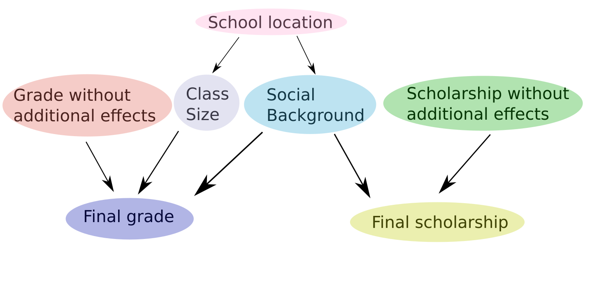

Installation
============

If you prefer to work on the source, clone the repository
::

   git clone https://github.com/eth-cscs/abcpy.git

Make sure all requirements are installed
::
   
   cd abcpy
   pip3 install -r requirements.txt

To create a package and install it do
::

   make package
   pip3 install build/dist/abcpy-0.1-py3-none-any.whl

Note that ABCpy requires Python3.

Getting Started
===============

Here, we explain how to use ABCpy to infer parameters of models, given some observed data sets.

If you are new to either inference in general, ABC or bayesian networks, we recommend you start with the 'Beginners' section. If you are already more experienced, there is an 'Advanced' section further along.

Beginners
=========

As a simple example, let us consider a Gaussian model. We want to model the height of a grown up human, given the following set of measurements, which we call observation or observed data.

.. literalinclude:: ../../examples/backends/dummy/pmcabc_gaussian.py
    :language: python
    :lines:
    :dedent: 4

Now, we want to model the height of humans by a Gaussian or Normal model, which has two parameters: the mean, denoted by :math:`\mu`, and the standard deviation, denoted by :math:`\sigma`. The goal is to use ABC to infer these yet unknown parameters from the information contained in the observed data.

A pre-requisite for ABC is that we provide certain *prior* knowledge about the parameters which we want to infer. In our case, it is quite simple. We know from experience that the average height should be somewhere between 150cm and 200cm, while the standard deviation is around 5 to 25.

.. literalinclude:: ../../examples/backends/dummy/pmcabc_gaussian.py
    :language: python
    :lines: 8-10, 12-13
    :dedent: 4

Note that this prior, in general, can be a much more complicated structure. Each input parameter for a probabilistic model, defined in **abcpy.continuousmodels** or **abcpy.discretemodels** can again be a probabilistic model. To see how this is implemented, see the 'Advanced' section. In the rest of this section, we will refer to each distribution of the prior as a *node*.

Further, we need a means to quantify how close our observation is to synthetic
data (generated by the model). Often, the real and synthetic observations cannot
compared directly in a reasonable of efficient way. Thus, *summary statistics*
are used to extract relevant properties from the observations, with the idea the
these stastistics then compare.

.. literalinclude:: ../../examples/backends/dummy/pmcabc_gaussian.py
    :language: python
    :lines: 16-17
    :dedent: 4
	     
As a distance we chose the LogReg distance here. Note that in ABCpy distance
functions operate not on the observations, but on summary statistics.

.. literalinclude:: ../../examples/backends/dummy/pmcabc_gaussian.py
    :language: python
    :lines: 20-21
    :dedent: 4	    

We can now set up an inference scheme -- let us chose PMCABC as our inference
algorithm of choice. As a pre-requisit, it requires a perturbation kernel. For this, we need to specify all nodes that will be perturbed by a kernel. This is simple in our case, however, for more complicated priors, it will be possible to define different kernels acting on a different set of nodes. Check out the 'Advanced' section to learn more.

.. literalinclude:: ../../examples/backends/dummy/pmcabc_gaussian.py
    :language: python
    :lines: 24-25
    :dedent: 4

Please note that it would also be possible to not specify a kernel. In this case, a **DefaultKernel** object will be initialized when creating the PMCABC object. However, in general, it is often desirable to define your own kernel.

We also need to define a backend:

.. literalinclude:: ../../examples/backends/dummy/pmcabc_gaussian.py
    :language: python
    :lines: 29-30
    :dedent: 4

We instanciate a PMCABC object and pass the kernel and backend objects to the
constructor:

.. literalinclude:: ../../examples/backends/dummy/pmcabc_gaussian.py
    :language: python
    :lines: 33-34
    :dedent: 4	    

Note that the model is given as a list. This is due to the fact that in ABCpy, it is possible to have multiple models associated with an overall prior, all giving seperate data sets. To learn more, see the 'Advanced' section.

Finally, we need to parametrize and start the actual sampling:

.. literalinclude:: ../../examples/backends/dummy/pmcabc_gaussian.py
    :language: python
    :lines: 37-40
    :dedent: 4

Again, observe that the observations are passed as a list. This is again due to the possibility of having multiple models.
	     
With this the inference process is done and the probabilities of the inferred
parameters are stored in the journal object. See `Post Analysis`_ for further
information on extracting results.

The code currently uses the dummy backend `BackendDummy` which does not
parallelize the execution of the inference schemes, but is very handy quick
prototyping and testing. To execute the code you only need to run

::
   
   python3 gaussian.py

The full source can be found in `examples/backends/dummy/pmcabc_gaussian.py`.

Advanced
========

Since release XX.XX of ABCpy, it is possible to define more complicated priors than previously. You can now define your prior to be a bayesian network. This means, in short, that any distribution, in what follows called *probabilistic model*, can have other probabilistic models as its parameters. It is now also possible to perform operations on probabilistic models.

To see what this means, let us consider the following model:

We are considering a school with different classes. Each class has some number of students. All students of the school take an exam and receive some grade. These grades are our first observed data set.

.. literalinclude:: ../../examples/backends/dummy/pmcabc_network.py
    :language: python
    :lines: 6
    :dedent: 4

We assume that these grades depend on two priors: the size of the class a student is in, as well as the social background from which the student originates. Both of these quantities can be described using some penalty score. Let's assume that the scores are both normally distributed with some mean and variance. However, they also both depend on the location of the school. We, therefore, have an additional parameter in our prior, specifiying that the mean of these normal distributions will vary uniformly between two lower and upper bounds.

Let us define these quantities and dependencies in ABCpy:

.. literalinclude:: ../../examples/backends/dummy/pmcabc_network.py
    :language: python
    :lines: 9-10, 16, 18
    :dedent: 4

First, observe that the individual parameters given to *Normal* are given as lists. This is to keep a uniform interface for all probabilistic models.

Second, also notice how the access operator is used for probabilistic models in ABCpy. With the access operator, it is possible to only use certain sampled values of a probabilistic model as parameters of another model. If a probabilistic model is n-dimensional and no access operator is specified, then the next n parameters of the new probabilistic model will be assigned to the respective values.

Let's now get back to our overall model.
We can imagine that if the effects of the priors defined above are negligible, the grades would be normally distributed around some mean:

.. literalinclude:: ../../examples/backends/dummy/pmcabc_network.py
    :language: python
    :lines: 21
    :dedent: 4

So, each student will receive some grade which is normally distributed, but this grade is distorted by the other priors defined above. The model which we obtain for the grade of some student, hence, can be written as:

.. literalinclude:: ../../examples/backends/dummy/pmcabc_network.py
    :language: python
    :lines: 24
    :dedent: 4

Note that we here specified a model using operators. This allows for a lot of flexibility when creating models. Currently, the operators "+", "-", "*", "/" and "**", the power operator in python, are supported.

ABCpy not only supports the creation of complicated priors. It is now also possible to have multiple models, each associated with some observed data, that share some parts of their priors.

For example, let us assume that the school gives out scholarships to students. We could say that each student receives some score, depending on which it is decided whether he receives a scholarship. Assume this score is normally distributed:

.. literalinclude:: ../../examples/backends/dummy/pmcabc_network.py
    :language: python
    :lines: 27
    :dedent: 4

However, depending on the students social background, again, the score changed.

.. literalinclude:: ../../examples/backends/dummy/pmcabc_network.py
    :language: python
    :lines: 30
    :dedent: 4

Last but not least, we also need data associated with this second model:

.. literalinclude:: ../../examples/backends/dummy/pmcabc_network.py
    :language: python
    :lines: 9
    :dedent: 4

We are now done with specifying the complete structure of the models. Due to the graphical representation for bayesian networks, this can be called a *graph*.

As in the 'Beginners' section, we now need to define a summary statistics to extract relevant properties of our data.

.. literalinclude:: ../../examples/backends/dummy/pmcabc_network.py
    :language: python
    :lines: 33-34
    :dedent: 4

We will also again need to define some distance measure. However, unlike before, we now have two data sets, and we will need to define an overall distance for the two of them together. ABCpy defines a *DefaultJointDistance* which uses logistic regression to compare each data set individually. All individual distances are then added and the result is divided by the number of data sets given.

.. literalinclude:: ../../examples/backends/dummy/pmcabc_network.py
    :language: python
    :lines: 37-38
    :dedent: 4

However, it is very easy to implement your own distances, in case this does not suit you. You can check out our code here to have a starting point on how to do it: INCLUDE LINK TO DISTANCES.PY

Again, we also need a backend:

.. literalinclude:: ../../examples/backends/dummy/pmcabc_network.py
    :language: python
    :lines: 41-42
    :dedent: 4

Finally, we need to specify some kernel to perturb all parameters given by the prior. The parameters that need to be perturbed correspond to the school location, the class size, the social background, the grade and the scholarship score.

To mix things up from the 'Beginners' section, let us define a few different Kernels, operating on different parameters. For each kernel, it is necessary to specify all the probabilistic models that should be perturbed by this kernel. Assuming the parameters corresponding to the school location and scholarship score are perturbed using a multivariate normal distribution, while the parameters corresponding to class size, social background and grade are are perturbed by a multivariate Student's T-distribution:

.. literalinclude:: ../../examples/backends/dummy/pmcabc_network.py
    :language: python
    :lines: 45-47
    :dedent: 4

To make things easier for our algorithm, we need to pack all kernels together into one overall 'kernel object'. For this, we provide the :py:class:`abcpy.perturbationkernel.JointPerturbationKernel` class.

.. literalinclude:: ../../examples/backends/dummy/pmcabc_network.py
    :language: python
    :lines: 50-51
    :dedent: 4

Now, we just have to define our sampling parameters

.. literalinclude:: ../../examples/backends/dummy/pmcabc_network.py
    :language: python
    :lines: 54-56
    :dedent: 4

, define our PMCABC object

.. literalinclude:: ../../examples/backends/dummy/pmcabc_network.py
    :language: python
    :lines: 59-60
    :dedent: 4

and sample:

.. literalinclude:: ../../examples/backends/dummy/pmcabc_network.py
    :language: python
    :lines: 63
    :dedent: 4

Before you head off to implement your own models, note that there are more probabilistic models describing both continuous and discrete distributions than described in this tutorial. A comprehensive list can be found in INSERT A LINK HERE

Post Analysis
=============

The output when sampling from an inferrence scheme is a Journal
(:py:class:`abcpy.output.Journal`) which holds all the necessary results and
convenient methods to do the post analysis.

For example, one can easily access the sampled parameters and corresponding
weights using:

.. literalinclude:: ../../examples/backends/dummy/pmcabc_gaussian.py
    :language: python
    :lines: 48-49
    :dedent: 4

For the post analysis basic functions are provided:	    

.. literalinclude:: ../../examples/backends/dummy/pmcabc_gaussian.py
    :language: python
    :lines: 52-53
    :dedent: 4
	     
Also, to ensure reproducibility, every journal stores the parameters of the
algorithm that created it:

.. literalinclude:: ../../examples/backends/dummy/pmcabc_gaussian.py
    :language: python
    :lines: 57
    :dedent: 4
	     
And certainly, a journal can easily be saved to and loaded from disk:

.. literalinclude:: ../../examples/backends/dummy/pmcabc_gaussian.py
    :language: python
    :lines: 60, 63
    :dedent: 4

       
Using Parallelization Backends
==============================

Running ABC algorithms is often computationally expensive, thus ABCpy is build
with parallelization in mind. In order to run your inference schemes in parallel
on multiple nodes (computers) you can choose from the following backends.

Using the Spark Backend
~~~~~~~~~~~~~~~~~~~~~~~

To run ABCpy in parallel using Apache Spark, one only needs to use the provided
Spark backend. Considering the example from above, the statements for the
backend have to be changed to

.. literalinclude:: ../../examples/backends/apache_spark/pmcabc_gaussian.py
    :language: python
    :lines: 6-9
    :dedent: 4

In words, a Spark context has to be created and passed to the Spark
backend. Additionally, the level of parallelism can be provided, which defines in
a sense in how many blocks the work should be split up. It corresponds to the
parallelism of an RDD in Apache Spark terminology. A good value is usually a
small multiple of the total number of available cores.

The standard way to run the script on Spark is via the spark-submit command:

::
   
   PYSPARK_PYTHON=python3 spark-submit pmcabc_gaussian.py

Often Spark installations use Python 2 by default. To make Spark use the
required Python 3 interpreter, the `PYSPARK_PYTHON` environment variable can be
set.

The adapted python code can be found in
`examples/backend/apache_spark/pmcabc_gaussian.py`.

Note that in order to run jobs in parallel you need to have Apache Spark
installed on the system in question. The dependencies of the MPI backend can be
install with `pip install -r requirements/backend-spark.txt`.

Details on the installation can be found on the official `homepage
<http://spark.apache.org>`_. Further, keep in mind that the ABCpy library has to
be properly installed on the cluster, such that it is available to the Python
interpreters on the master and the worker nodes.

Using the MPI Backend
~~~~~~~~~~~~~~~~~~~~~

To run ABCpy in parallel using MPI, one only needs to use the provided MPI
backend. Using the same example as above, the statements for the backend have to
be changed to

.. literalinclude:: ../../examples/backends/mpi/pmcabc_gaussian.py
    :language: python
    :lines: 6-7
    :dedent: 4

In words, one only needs to initialize an instance of the MPI backend. The
number of ranks to spawn are specified at runtime through the way the script is
run. A minimum of two ranks is required, since rank 0 (master) is used to
orchestrade the calculation and all other ranks (workers) actually perform the
calculation.

The standard way to run the script using Open MPI is directly via mpirun like below 
or on a cluster through a job scheduler like Slurm:

::
   
   mpirun -np 4 python3 pmcabc_gaussian.py

The adapted Python code can be found in
`examples/backend/mpi/pmcabc_gaussian.py`.
   
Note that in order to run jobs in parallel you need to have MPI installed on the
system(s) in question with the requisite Python bindings for MPI (mpi4py). The
dependencies of the MPI backend can be install with
`pip install -r requirements/backend-mpi.txt`.

Details on the installation can be found on the official `Open MPI homepage
<https://www.open-mpi.org/>`_ and the `mpi4py homepage
<https://mpi4py.scipy.org/>`_. Further, keep in mind that the ABCpy library has
to be properly installed on the cluster, such that it is available to the Python
interpreters on the master and the worker nodes.

Using Cluster Infrastructure
============================

When your model is computationally expensive and/or other factors require
compute infrastructure that goes beyond a single notebook or workstation you can
easily run ABCpy on infrastructure for cluster or high-performance computing.

Running on Amazon Web Services
~~~~~~~~~~~~~~~~~~~~~~~~~~~~~~

We show with high level steps how to get ABCpy running on Amazon Web Services
(AWS). Please note, that this is not a complete guide to AWS, so we would like
to refer you to the respective documentation. The first step would be to setup a
AWS Elastic Map Reduce (EMR) cluster which comes with the option of a
pre-configured Apache Spark. Then, we show how to run a simple inference code on
this cluster.

Setting up the EMR Cluster
~~~~~~~~~~~~~~~~~~~~~~~~~~

When we setup an EMR cluster we want to install ABCpy on every node of the
cluster. Therefore, we provide a bootstrap script that does this job for us. On
your local machine create a file named `emr_bootstrap.sh` with the following
content:

::
   
   #!/bin/sh
   sudo yum -y install git
   sudo pip-3.4 install ipython findspark abcpy

In AWS go to Services, then S3 under the Storage Section. Create a new bucket
called `abcpy` and upload your bootstrap script `emr_bootstap.sh`.

To create a cluster, in AWS go to Services and then EMR under the Analytics
Section. Click 'Create Cluster', then choose 'Advanced Options'. In Step 1
choose the emr-5.7.0 image and make sure only Spark is selected for your cluster
(the other software packages are not required). In Step 2 choose for example one
master node and 4 core nodes (16 vCPUs if you have 4 vCPUs instances). In Step 3
under the boostrap action, choose custom, and select the script
`abcpy/emr_bootstrap.sh`. In the last step (Step 4), choose a key to access the
master node (we assume that you already setup keys). Start the cluster.

Running ABCpy on AWS
~~~~~~~~~~~~~~~~~~~~

Log in via SSH and run the following commands to get an example code from ABCpy
running with Python3 support:

::
   
   sudo bash -c 'echo export PYSPARK_PYTHON=python34 >> /etc/spark/conf/spark-env.sh'
   git clone https://github.com/eth-cscs/abcpy.git

Then, to submit a job to the Spark cluster we run the following commands:

::
   
   cd abcpy/examples/backends/
   spark-submit --num-executors 16 pmcabc_gaussian.py

Clearly the setup can be extended and optimized. For this and basic information
we refer you to the `AWS documentation on
EMR <http://docs.aws.amazon.com/emr/latest/ManagementGuide/emr-overview.html>`_.
   

	    
Implementing a new Model
========================

Often one wants to use one of the provided inference schemes on a new probabilistic model,
which is not part of ABCpy. We now go through the details of such a scenario
using the probabilistic model of the Normal distribution to exemplify the mechanics.

Every model has to conform to the API specified by the base class
:py:class:`abcpy.probabilisticmodels.ProbabilisticModel`. Thus, making a new model compatible with ABCpy, essentially boils down to implementing the following methods:

.. literalinclude:: ../../abcpy/probabilisticmodels.py
    :language: python
    :lines: 15, 128, 140, 152, 164, 177

Of course, if your model does not have a easily implemented probability density function, this method does not have to be provided. But keep in mind that in this case, your model can only be used as one of the root models of the network, and not for any nodes contained in the prior. The prior can only contain probabilistic models that have a defined probability density function.

In the following we go through a few of the required methods, explain what is expected, and
show how it would be implemented for the Gaussian model.

As a general note, one can say that it is always a good  idea to
consult the reference for implementation details. For the constructor, the reference of the base class states:

.. literalinclude:: ../../abcpy/probabilisticmodels.py
    :language: python
    :lines: 11-13

The constructor expects to receive a list, containing all parameters of the new model. These can be given in three ways:

First, a tupel, containing the parent, a probabilistic model object, as well as the output index. The output index refers to the index of a sample of the parent model which should be used for a parameter. Such a tupel is also returned when the access operator is used.

Second, a probabilistic model. This ensures, like the first point, that a graphical structure can be implemented.

Finally, a hyperparameter. This refers to any fixed value that can be given. The constructor of the :py:class:`abcpy.probabilisticmodels.ProbabilisticModel` is implemented such that fixed values will always be converted to an object of type :py:class:`abcpy.probabilisticmodels.Hyperparameter`.

If we would like to implement our own constructor of a new model, we should in the end call the constructor of :py:class:`abcpy.probabilisticmodels.ProbabilisticModel`.

Consequently, we would implement a simple version of a Gaussian model as follows:

.. literalinclude:: ../../examples/extensions/models/gaussian_python/pmcabc_normal_model_simple.py
    :language: python
    :lines: 6-8

Note that this implementation slightly differs from the actual ABCpy implementation. This is due to the fact that we wanted to provide the user with the opportunity to give each parameter of the Normal model as a list, in order to keep a uniform interface for all distributions. Since the :py:class:`abcpy.probabilisticmodels.ProbabilisticModel` class does not expect your parameters to be lists of probabilistic models, but just probabilistic models, we would have to rewrite the user input in order to provide this feature.

Also, observe that we defined an additional attribute **self.dimension**. This attribute has to be defined for any probabilistic model you implement. It defines the dimension a sample of your probabilistic model will have. Since a normal distribution will give one value per sample, its dimension is one.

If you have a look at the definition of the constructor of :py:class:`abcpy.probabilisticmodels.ProbabilisticModel`, you might notice the following statement:

.. literalinclude:: ../../examples/extensions/models/gaussian_python/pmcabc_normal_model_simple.py
    :language: python
    :lines: 37

Before this, all parameters given to the model are rewritten in the following way:

As we said before, each entry in the parameters list can be of type :py:class:`abcpy.probabilisticmodels.ProbabilisticModel`, a fixed value, or a tupel.

However, to easily check parent nodes, as well as the correct output index for these parents, it is best to save all these parameters as a tupel. If an n dimensional :py:class:`abcpy.probabilisticmodels.ProbabilisticModel` is given, the list you see denoted as *parents_temp* will contain n tupels, where the first entry is each time said :py:class:`abcpy.probabilisticmodels.ProbabilisticModel` and the second entry is numbered from 0 to n-1, the indices of a sampled value from the :py:class:`abcpy.probabilisticmodels.ProbabilisticModel`.

If a user provided a fixed value, this value is converted to an object of type :py:class:`abcpy.probabilisticmodels.Hyperparameter` and the tupel contains this object as the first entry and 0 as the second entry.

Finally, if a user used the access operator, the tupel will contain the :py:class:`abcpy.probabilisticmodels.ProbabilisticModel` as well as the index which was given in the access operator.

Now, we need to check whether the parameters that were given to our new :py:class:`abcpy.probabilisticmodels.ProbabilisticModel` are valid parameters:

.. literalinclude:: ../../examples/extensions/models/gaussian_python/pmcabc_normal_model_simple.py
    :language: python
    :lines: 10-15

This ensures that we give exactly two values to a the model and that the variance will not be smaller than 0.

Note that this method is not expected to have a return value. It is simply there to prevent the user from giving wrong inputs to probablistic models. If your model does not have any such constraints, you still need to implement the method, however, you can simply return without doing anything.

Next, we need the following method:

.. literalinclude:: ../../abcpy/probabilisticmodels.py
    :language: python
    :lines: 140

You might wonder what this method is for. We can imagine that our normal model might have a variance that is not a fixed value, but rather comes from some other :py:class:`abcpy.probabilisticmodels.ProbabilisticModel` object. This so called parent might be able to sample negative values. Due to the graph structure in ABCpy, it would, therefore, be possible that our model would receive a negative value for its variance and for example would try to sample using that variance. This should not be possible.

So, we have the following implementation:

.. literalinclude:: ../../examples/extensions/models/gaussian_python/pmcabc_normal_model_simple.py
    :language: python
    :lines: 17-20

This method returns a boolean. It returns **True** if the parameters are accepted for sampling, and **False** otherwise.

Next, we need the method:

.. literalinclude:: ../../abcpy/probabilisticmodels.py
    :language: python
    :lines: 152

Again, let us explain the use of this method. A lot of the implemented ABC algorithms involve perturbing previously selected parameters using a perturbation kernel. Then, we try to fix the values for the parameters to these perturbed values. However, it could of course be possible that for some node of our graph, the perturbed value is not acceptable. For example because the node can only return positive values, but the perturbation changed the parameter to some negative value. In this case, the parameters should be rejected.

However, for the normal model we are trying to implement, all values are acceptable. This is due to the fact that the range of a normal distribution is the reel numbers.

.. literalinclude:: ../../examples/extensions/models/gaussian_python/pmcabc_normal_model_simple.py
    :language: python
    :lines: 22-23

Next, we get to the sampling method:

.. literalinclude:: ../../abcpy/probabilisticmodels.py
    :language: python
    :lines: 164

Even if your model does not strictly implement a distribution, it is still named this way to avoid confusion. This method should simply sample the distribution associated with the :py:class:`abcpy.probabilisticmodels.ProbabilisticModel` or simulate from a model.

There are two input parameters, *k* and *rng*. *k* corresponds to the number of parameters that should be sampled. *rng* defines a random number generator. Keep in mind that other methods will try to send their random number generator to this method during sampling. It is, therefore, recommended that you use a numpy random number generator.

Also, even if you do not have any behavior implemented that requires a random number generator, it still needs to be passed to this function (due to the fact that other probabilistic models are based on random number generators). Hence, even if you do not need it, please specify the random number generator as a parameter.

Now, let's look at the implementation of the method for our model:

.. literalinclude:: ../../examples/extensions/models/gaussian_python/pmcabc_normal_model_simple.py
    :language: python
    :lines: 25-36

First, we need to obtain the values that correspond to each parameter of our model. Since the parents of our object can be of type :py:class:`abcpy.probabilisticmodels.ProbabilisticModel`, the values might not always be the same, and need to be obtained each time we want to sample. You do not need to implement the method used to to this, as long as you have used the constructor of the :py:class:`abcpy.probabilisticmodels.ProbabilisticModel` class at the start.

Now, we check whether the the values we obtained are okay to be used by our model. Whether this is the case forms the first entry in the list that we will return. Note that this is a necessary requirement. Other methods expect the first entry in this list to be a boolean corresponding to whether or not we could (and did) sample for this model.

Then, if the values are fine to be used, we simply sample using the random number generator, append this to the list that will be returned, and return the list.

Finally, we need to implement the probability density function. Again, this is not a must, but if there is no probability density function, it will only be possible to use the model as one of the roots (i.e. it cannot be part of the prior).

.. literalinclude:: ../../examples/extensions/models/gaussian_python/pmcabc_normal_model_simple.py
    :language: python
    :lines: 38-42

Again, we first need to obtain the values associated with all parents of the current model. However, we do not need to check these values, since pdfs will only be calculated after it is made sure that all values are allowed within the graph structure. We then calculate the pdf accordingly.

Our model now conforms to ABCpy and we can start inferring parameters in the
same way (see `Getting Started`_) as we would do with shipped models. The
complete example code can be found `here
<https://github.com/eth-cscs/abcpy/blob/master/examples/gaussian_extended_with_model.py>`_

Wrap a Model Written in C++
~~~~~~~~~~~~~~~~~~~~~~~~~~~

There are several frameworks that help you integrating your C++/C code into
Python. We showcase examples for

* `Swig <http://www.swig.org/>`_
* `Pybind <https://github.com/pybind>`_

Using Swig
~~~~~~~~~~

Swig is a tool that creates a Python wrapper for our C++/C code using an
interface (file) that we have to specify. We can then import the wrapper and
in turn use your C++ code with ABCpy as if it was written in Python.

We go through a complete example to illustrate how to use a simple Gaussian
model written in C++ with ABCpy. First, have a look at our C++ model:

.. literalinclude:: ../../examples/extensions/models/gaussian_cpp/gaussian_model_simple.cpp
   :language: c++
   :lines: 9 - 17

To use this code in Python, we need to specify exactly how to expose the C++
function to Python. Therefore, we write a Swig interface file that look as
follows:

.. literalinclude:: ../../examples/extensions/models/gaussian_cpp/gaussian_model_simple.i
   :language: c++

In the first line we define the module name we later have to import in your
ABCpy Python code. Then, in curly brackets, we specify which libraries we want
to include and which function we want to expose through the wrapper.

Now comes the tricky part. The model class expects a method `simulate` that
forward-simulates our model and which returns an array of syntetic
observations. However, C++/C does not know the concept of returning an array,
instead in C++/C we would provide a memory position (pointer) where to write
the results. Swig has to translate between the two concepts. We use actually an
Swig interface definition from numpy called `import_array`. The line

.. literalinclude:: ../../examples/extensions/models/gaussian_cpp/gaussian_model_simple.i
   :language: c++
   :lines: 18

states that we want the two parameters `result` and `k` of the `gaussian_model`
C++ function be interpreted as an array of length k that is returned. Have a
look at the Python code below and observe how the wrapped Python function takes only two
instead of four parameters and returns a numpy array.

The first stop to get everything running is to translate the Swig interface file
to wrapper code in C++ and Python.
::

   swig -python -c++ -o gaussian_model_simple_wrap.cpp gaussian_model_simple.i

This creates two wrapper files `gaussian_model_simple_wrap.cpp` and
`gaussian_model_simple.py`. Now the C++ files can be compiled:
::
   
   g++ -fPIC -I /usr/include/python3.5m -c gaussian_model_simple.cpp -o gaussian_model_simple.o
   g++ -fPIC -I /usr/include/python3.5m -c gaussian_model_simple_wrap.cpp -o gaussian_model_simple_wrap.o
   g++ -shared gaussian_model_simple.o gaussian_model_simple_wrap.o -o _gaussian_model_simple.so

Note that the include paths might need to be adapted to your system. Finally, we
can write a Python model which uses our C++ code:

.. literalinclude:: ../../examples/extensions/models/gaussian_cpp/pmcabc-gaussian_model_simple.py
   :language: python
   :lines: 3 - 32

The important lines are where we import the wrapper code as a module (line 2) and call
the respective model function (line -2).

The full code is available in `examples/extensions/models/gaussion_cpp/`. To
simplify compilation of SWIG and C++ code we created a Makefile. Note that you
might need to adapt some paths in the Makefile.
	    
Wrap a Model Written in R
-------------------------

Statisticians often use the R language to build statistical models. R models can
be incorporated within the ABCpy language with the `rpy2` Python package. We
show how to use the `rpy2` package to connect with a model written in R.

Continuing from the previous sections we use a simple Gaussian model as an
example. The following R code is the contents of the R file `gaussian_model.R`:

.. literalinclude:: ../../examples/extensions/models/gaussian_R/gaussian_model.R
    :language: R
    :lines: 1 - 4

More complex R models are incorporated in the same way. To include this function
within ABCpy we include the following code at the beginning of our Python file:

.. literalinclude:: ../../examples/extensions/models/gaussian_R/gaussian_model.py
    :language: python
    :lines: 5 - 14

This imports the R function `simple_gaussian` into the Python environment. We
need to build our own model to incorporate this R function as in the previous
section. The only difference is the `simulate` method of the class `Gaussian'.

.. automethod:: abcpy.models.Model.simulate
   :noindex:

.. literalinclude:: ../../examples/extensions/models/gaussian_R/gaussian_model.py
    :language: python
    :lines: 40 - 42

The default output for R functions in Python is a float vector. This must be
converted into a Python list for the purposes of ABCpy.

..
  Extending: Add your Distance
  ============================
  TBD
  Extending: Add your Statistics
  ==============================
  TBD
  Extending: Add your approx_likelihood
  =====================================
  TBD
  Extending: Add you prior
  ========================
  TBD
  Extending: Add your own inference scheme
  ========================================
  TBD
  Use ABCpy with a C++ model
  ==========================
  TBD

