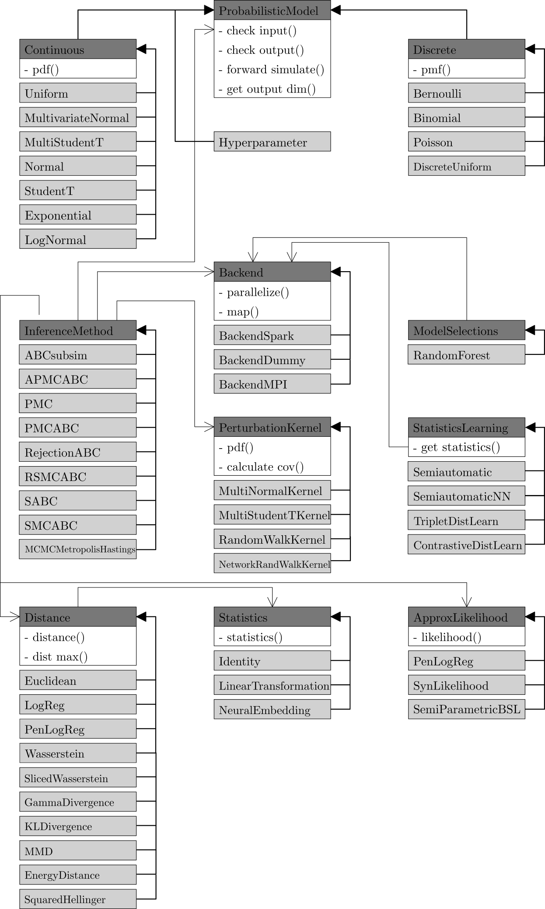

abcpy package
=============

This reference gives details about the API of modules, classes and functions included in ABCpy.

The following diagram shows selected classes with their most important
methods. Abstract classes, which cannot be instantiated, are highlighted in
dark gray and derived classes are highlighted in light gray. Inheritance is
shown by filled arrows. Arrows with no filling highlight associations, e.g.,
:py:class:`Distance <abcpy.distances.Distance>` is associated with :py:class:`Statistics <abcpy.statistics.Statistics>`
because it calls a method of the instantiated class to translate the input data to summary statistics.

.. currentmodule:: abcpy

abcpy.acceptedparametersmanager module
--------------------------------------

.. automodule:: abcpy.acceptedparametersmanager
    :members:
    :special-members: __init__, _reset_flags
    :undoc-members:
    :show-inheritance:

		   
abcpy.approx_lhd module
-----------------------

.. automodule:: abcpy.approx_lhd
    :members:
    :special-members: __init__       
    :undoc-members:
    :show-inheritance:

abcpy.backends module
---------------------

.. automodule:: abcpy.backends.base
    :members:
    :special-members: __init__
    :undoc-members:
    :show-inheritance:

.. automodule:: abcpy.backends.spark
    :members:
    :special-members: __init__
    :undoc-members:
    :show-inheritance:

.. automodule:: abcpy.backends.mpi
    :members:
    :special-members: __init__
    :undoc-members:
    :show-inheritance:

abcpy.continuousmodels module
-----------------------------

.. automodule:: abcpy.continuousmodels
    :members:
    :special-members: __init__, _check_parameters_at_initialization, _check_parameters_before_sampling, _check_output
    :undoc-members:
    :show-inheritance:

abcpy.discretemodels module
---------------------------

.. automodule:: abcpy.discretemodels
    :members:
    :special-members: __init__, _check_parameters_at_initialization, _check_parameters_before_sampling, _check_output
    :undoc-members:
    :show-inheritance:

abcpy.distances module
----------------------

.. automodule:: abcpy.distances
    :members:
    :special-members: __init__, _calculate_summary_stat
    :undoc-members:
    :show-inheritance:

abcpy.graphtools module
-----------------------

.. automodule:: abcpy.graphtools
    :members:
    :special-members: __init__, _sample_from_prior, _reset_flags, _get_mapping, _get_names_and_parameters
    :undoc-members:
    :show-inheritance:

abcpy.inferences module
-----------------------

.. automodule:: abcpy.inferences
    :members:
    :special-members: __init__
    :undoc-members:
    :show-inheritance:

abcpy.modelselections module
----------------------------

.. automodule:: abcpy.modelselections
   :members:
   :special-members: __init__
   :undoc-members:
   :show-inheritance:

abcpy.NN_utilities module
-------------------------

Functions and classes needed for the neural network based summary statistics learning.

.. automodule:: abcpy.NN_utilities.algorithms
   :members:
   :special-members: __init__
   :undoc-members:
   :show-inheritance:

.. automodule:: abcpy.NN_utilities.datasets
   :members:
   :special-members: __init__
   :undoc-members:
   :show-inheritance:

.. automodule:: abcpy.NN_utilities.losses
   :members:
   :special-members: __init__
   :undoc-members:
   :show-inheritance:

.. automodule:: abcpy.NN_utilities.networks
   :members:
   :special-members: __init__
   :undoc-members:
   :show-inheritance:

.. automodule:: abcpy.NN_utilities.trainer
   :members:
   :special-members: __init__
   :undoc-members:
   :show-inheritance:

.. automodule:: abcpy.NN_utilities.utilities
   :members:
   :special-members: __init__
   :undoc-members:
   :show-inheritance:

abcpy.output module
-------------------

.. automodule:: abcpy.output
    :members:
    :special-members: __init__       
    :undoc-members:
    :show-inheritance:

abcpy.perturbationkernel module
-------------------------------

.. automodule:: abcpy.perturbationkernel
    :members:
    :special-members: __init__
    :undoc-members:
    :show-inheritance:

abcpy.probabilisticmodels module
--------------------------------

.. automodule:: abcpy.probabilisticmodels
    :members:
    :special-members: __init__, _check_input, _check_output, __get_item__, __add__, __sub__, __mul__, __truediv__, __pow__
    :undoc-members:
    :show-inheritance:

abcpy.statistics module
-----------------------

.. automodule:: abcpy.statistics
   :members:
   :special-members: __init__
   :undoc-members:
   :show-inheritance:

abcpy.statisticslearning module
-------------------------------

.. automodule:: abcpy.statisticslearning
   :members:
   :special-members: __init__
   :undoc-members:
   :show-inheritance:
