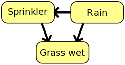

.. _bayes_nets:

Bayesian networks - an introduction
======================================

Since ABCpy XX.XX, it is possible to perform inference on bayesian networks. To illustrate what this means, let us consider the following example from Wikipedia:

The fact whether the grass is wet is called our observed data. We can look outside and easily see whether this is true or not.

The observation of grass being wet can be due to two circumstances: the sprinkler is running or it is raining. This is indicated by the arrows going from sprinkler/rain to grass.

Finally, there is also an arrow going from rain to sprinkler. If there is rain, we assume our sprinkler is smart enough to not run.

In general in bayesian networks, the parameters of interest (whether the sprinkler is running and whether it is raining), as well as the model (whether the grass is wet, the thing we can observe) are called *nodes* and represented as in the picture above.
Dependencies are represented as arrows.

As you can see, this structure can be seen as a graph. For a graph to be a bayesian network, some things need to be fulfilled:

1) the graph is directed. This means that the arrows, the edges of the graph, have a direction associated with them. The direction tells us which parameter affects which other parameter. In our example, rain affects whether the sprinkler is running. Therefore, there is a directed edge from rain to sprinkler. However, the sprinkler does not affect whether it is raining, and, therefore, there is no directed edge from sprinkler to rain.

2) the graph is acyclic. This means that no parameter can indirectly or indirectly affect itself.

If these properties are ensured, you can implement the dependency structure in ABCpy, and perform inference on it.