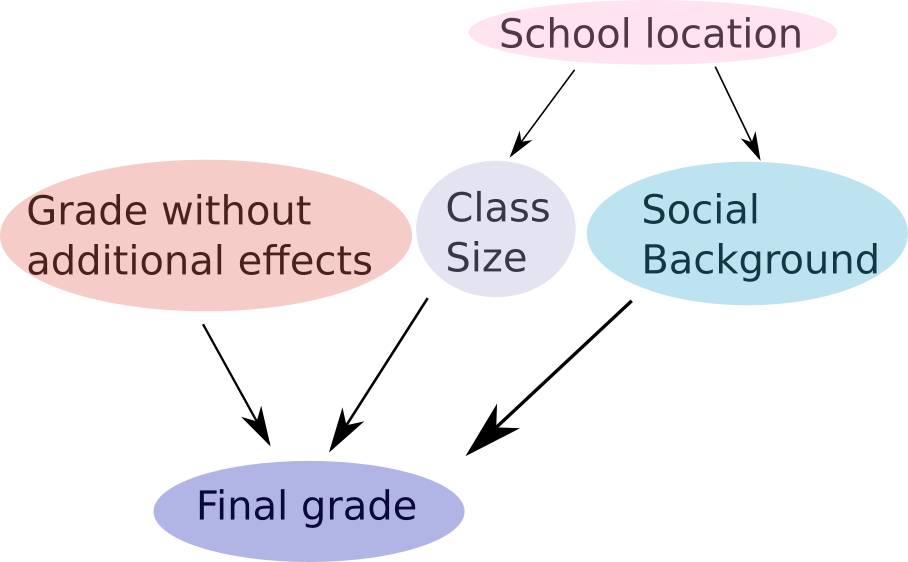
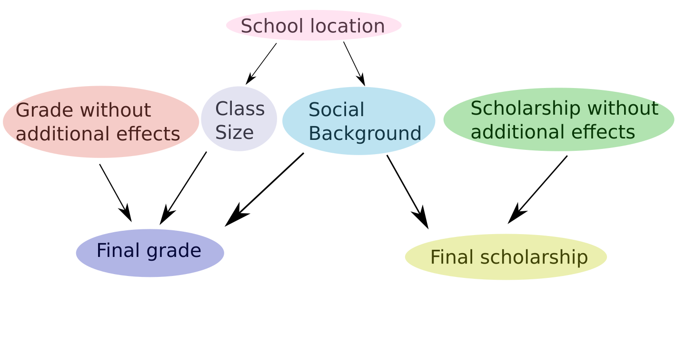

.. _gettingstarted:

2. Getting Started
==================

Here, we explain how to use ABCpy to quntify parameter uncertainty of a model given some observed dataset.

If you are new to uncertainty quantification using Approximate Bayesian Computation (ABC), we recommend you to start with the `Parameters as Random variables`_ section. If you would like to see all features in action together, check out `Complex perturbation kernels`_.

Parameters as Random variables
~~~~~~~~~~~~~~~~~~~~~~

As an example, if we have measurements of the height of a group of grown up human and it is also known that a Gaussian distribution is appropriate to model these kind of observations, then our observed dataset would be measurement of heights and the model would be Gaussian.

.. literalinclude:: ../../examples/backends/dummy/pmcabc_gaussian.py
    :language: python
    :lines: 5
    :dedent: 4

Gaussian or Normal model has two parameters: the mean, denoted by :math:`\mu`, and the standard deviation, denoted by :math:`\sigma`. We consider these parameters as random variables. The goal of ABC is to quantify uncertainty of these parameters from the information contained in the observed data.

In ABCpy, a :py:class:`abcpy.probabilisticmodels.ProbabilisticModel` object represents a random variable. Each of the :py:class:`abcpy.probabilisticmodels.ProbabilisticModel` object has some input parameters: they are random variables (:py:class:`abcpy.probabilisticmodels.ProbabilisticModel` object) or constant valued and considered known to the user ('hyperparameter'). If you are interested in implementing your own random variable, please check the :ref:`Implementing a new Model <implementations>` section. 

We can also utilize *prior* knowledge about these parameters as *prior* distribution on the corresponding random variables. In this example, it is quite simple. We know from experience that the average height should be somewhere between 150cm and 200cm, while the standard deviation is around 5 to 25. 

.. literalinclude:: ../../examples/backends/dummy/pmcabc_gaussian.py
    :language: python
    :lines: 8-10, 12-14
    :dedent: 4

In this example we have defined the parameter :math:`\mu` and :math:`\sigma` of the Gaussian model as random variables and assigned Uniform prior distributions on them. The parameters of the prior distribution (150, 200, 5, 25) are assumed to be known to the user, hence they are called hyperparameters. 

You are required to pass a *name* string while defining a random variable. In the final output, you will see these names, together with the values that are drawn from the marginal posterior distribution of this parameter. (In the absence of prior knowledge, we still need to provide *prior* and which should be a non-informative prior.)

For ABC, the inference is done by a measure of discrepancy between the observed dataset and the synthetic dataset (simulated from the model). Often, computation of discrepancy measure between the observed and synthetic dataset is not feasible (e.g., high dimensionality of dataset) and the discrepancy measure is defined by computing a distance between relevant *summary statistics* extracted from the datasets. Here we first define a way to extract *summary statistics* from the dataset.

.. literalinclude:: ../../examples/backends/dummy/pmcabc_gaussian.py
    :language: python
    :lines: 16-17
    :dedent: 4

Next we define the discrepancy measure between the datasets, by defining a distance function (LogReg distance is chosen here) between the extracted summary statistics. If we want to define the discrepancy measure through a distance function between the datasets directly, we choose Identity as summary statistics which gives the original dataset as the extracted summary statistics. 
 
.. literalinclude:: ../../examples/backends/dummy/pmcabc_gaussian.py
    :language: python
    :lines: 20-21
    :dedent: 4

Let us choose PMCABC algorithm for inference of the parameters here. 

Algorithms in ABCpy requires a perturbation kernel, a tool to explore the parameter space. Here, we use the default kernel provided, which explores the parameter space of random variables, by perturbing it using a multivariate Gaussian distribution or performing a random walk if the  corresponding random variable is continuous or discrete. For a more involved example, please consult `Complex perturbation kernels`_.

.. literalinclude:: ../../examples/backends/dummy/pmcabc_gaussian.py
    :language: python
    :lines: 24-25
    :dedent: 4

We need to define a backend declaring the type of parallelization. The example code here uses the dummy backend `BackendDummy` which does not parallelize the execution of the inference schemes. But this is handy for prototyping and testing.

.. literalinclude:: ../../examples/backends/dummy/pmcabc_gaussian.py
    :language: python
    :lines: 29-30
    :dedent: 4

Now we are ready to instantiate a PMCABC object and pass the kernel and backend objects to the constructor:

.. literalinclude:: ../../examples/backends/dummy/pmcabc_gaussian.py
    :language: python
    :lines: 33-34
    :dedent: 4

Finally, we can parametrize the sampler and start sampling of the highly probable values of the parameters (proportional to their probability of occurance) given the observed dataset:

.. literalinclude:: ../../examples/backends/dummy/pmcabc_gaussian.py
    :language: python
    :lines: 37-40
    :dedent: 4

The above inference scheme gives us samples from the distribution of the parameter of interest quantifying the uncertainty of the inferred parameter, which are stored in the journal object. See :ref:`Post Analysis <postanalysis>` for further information on extracting results. 

For uncertainty quantification of the random variables, we will draw independent and identical sample values from their posterior distribution. These sampled values are usually called posterior samples and they are used to approximate the posterior distribution or for Monte Carlo integration w.r.t the posterior distribution. These values are what you will get as an end result of the inference.

Note that the model and the observations are given as a list. This is due to the fact that in ABCpy, it is possible to have Multi-view models, building relationships between co-occuring groups of datasets. To learn more, see the `Multi-view models`_ section.

The full source can be found in `examples/backends/dummy/pmcabc_gaussian.py`.

To execute the code you only need to run

::

   python3 pmcabc_gaussian.py

Multi-level Models
~~~~~~~~~~~~~~~~

Since release 0.4.0 of ABCpy, we can have complex dependency structures (e.g., a Bayesian network) between random variables. Behind the scene, ABCpy will ensure that this dependency structure is implemented and the inference will be performed on them. Further we can also define new random variables through operations between existing random variables. In the following we describe an inference problem illustrating both of these ideas. 

For this tutorial, we consider a school with different classes. Each class has some number of students. All students of the school take an exam and receive some grade. Lets consider the grades of the students as our observed dataset:

.. literalinclude:: ../../examples/backends/dummy/pmcabc_operations.py
    :language: python
    :lines: 6
    :dedent: 4

The grades of the students depend on several variables: if there were bias, the size of the class a student is in, as well as the social background of the student. The dependency structure between these variables can be defined using the following Bayesian network: 

Here we assume the size of a class the student belongs to and his/her social background are normally distributed with some mean and variance. However, they also both depend on the location of the school. In certain neighbourhoods, the class size might be larger, or the social background might differ. 

We, therefore, have additional parameters, specifying the mean of these normal distributions will vary uniformly between some lower and upper bounds. Finally, we can assume that the grade without any bias would be a normally distributed parameter around an average grade.

We can define these random variables and the dependencies between them (in a nutshell, a Bayesian network) in ABCpy:

.. literalinclude:: ../../examples/backends/dummy/pmcabc_operations.py
    :language: python
    :lines: 9-10, 13, 16, 19
    :dedent: 4

So, each student will receive some grade which is normally distributed, but this grade is determined by the other random variables defined. The model for the grade of the students now can be written as:

.. literalinclude:: ../../examples/backends/dummy/pmcabc_operations.py
    :language: python
    :lines: 22
    :dedent: 4

Notice here we created  a new random variable `final_grade`, by subtracting random variables `class_size` and `background` from ranodm variable `grade`. In short, this illustrates that you can perform operations "+", "-", "*", "/" and "**" (the power operator in Python) on any two random variables, to get a new random variable. It is possible to perform these operations between two random variables additionally to the general data types of Python (integer, float, and so on).

Please keep in mind that **parameters defined via operations will not be included in your list of parameters in the journal file**. However, all parameters that are part of the operation, and are not fixed, will be included, so you can easily perform the required operations on the final result to get these parameters, if necessary.

In addition to these operators, you can now also use the "[]" operator (the access operator in Python). This allows you to only use selected values from a multidimensional random variable sample as a parameter of a new random variable.

As in the `Parameters as Random variables`_ section, we now need to define a summary statistics to extract relevant properties of our data.

.. literalinclude:: ../../examples/backends/dummy/pmcabc_operations.py
    :language: python
    :lines: 25-26
    :dedent: 4

And just as before, we need to provide a distance measure, a backend and a kernel.

.. literalinclude:: ../../examples/backends/dummy/pmcabc_operations.py
    :language: python
    :lines: 29-30, 33-34, 37-38
    :dedent: 4

Now, again, we can parametrize the sampler and start sampling:

.. literalinclude:: ../../examples/backends/dummy/pmcabc_operations.py
    :language: python
    :lines: 41-43, 46-47, 50
    :dedent: 4

The source code can be found in `examples/backends/dummy/pmcabc_operations.py`.

An important thing to keep in mind: **random variables are initialized without sampling values from them immediately.** This works for inference algorithms, since these algorithms will contain a statement that samples from the prior first. However, if you want to implement a hierarchical model and then sample from a random variable within the tree structure, the necessary parameter values will not yet be defined. Therefore, if you want to have a 'stand-alone' distribution or model, you will need to call the method `sample_parameters()` for any parameter in the graph, which is best done right after initializing the relevant parameters. Only after this step is performed you can call the `sample_from_distribution()` method to obtain samples from the distribution.

Multi-view models
~~~~~~~~~~~~~~~~~~~~~~~~~~~~~~~~~~

As mentioned above, ABCpy supports inference on multiple hierarchical models at once. These hierarchical models can share some of the parameters of interest. To illustrate how this is implemented, we will extend the model given in `Multi-level Models`_.

As in the last section, our first model consists of the final grades students receive in an exam. This final grade depends on an average grade, the size of the class of each student and the students social background. The latter two variables also depend on the location of the school.

For an explanation of the code, please see `Multi-level Models`_.

We now consider the second hierarchical model. First, we again need to define our observed data set:

.. literalinclude:: ../../examples/backends/dummy/pmcabc_multiple_models.py
    :language: python
    :lines: 25
    :dedent: 4

Let us assume that the school gives out scholarships to students. Each student receives some score, which determines whether he will receive a scholarship or not. We assume that this score is normally distributed:

.. literalinclude:: ../../examples/backends/dummy/pmcabc_multiple_models.py
    :language: python
    :lines: 28
    :dedent: 4

However, depending on the students social background, the score will be changed, giving us the definition of our second hierarchical model.

.. literalinclude:: ../../examples/backends/dummy/pmcabc_multiple_models.py
    :language: python
    :lines: 31
    :dedent: 4

As in the algorithms before, we now define summary statistics, distance, backend and kernel. We will skip the definitions that have not changed from the previous section. However, we would like to point out the difference in definition of the distance.

Since we are now considering two hierarchical models, we need to define an overall distance on the two. Here, we use the default distance provided in ABCpy. It uses the euclidean distance for each hierarchical model and corresponding data set seperatly. All distances are added, and the result is divided by the number of data sets given. If you would like to implement a different distance measure on multiple data sets, check :ref:`Implementing a new Distance <implementations>`.

.. literalinclude:: ../../examples/backends/dummy/pmcabc_multiple_models.py
    :language: python
    :lines: 38-39
    :dedent: 4

We then parametrize the sampler and sample:

.. literalinclude:: ../../examples/backends/dummy/pmcabc_multiple_models.py
    :language: python
    :lines: 50-52, 55-56, 59
    :dedent: 4

Observe that the lists given to the sampler and the sampling method now contain two entries. These correspond to the two hierarchical models and the observed data for the two models, respectively.

The source code can be found in `examples/backends/dummy/pmcabc_multiple_models.py`.

Complex perturbation kernels
~~~~~~~~~~~~~~~~~~~~~~~~~~

We will consider the same example as in the `Multi-view models`_ section.

As pointed out earlier, it is possible to define complex perturbation kernels, perturbing random variables in different ways. Let us assume that we want to perturb the schools location, as well as the scholarship score, using a multivariate normal kernel. However, the remaining parameters we would like to perturb using a multivariate Student's-T kernel.

This can be implemented as following:

.. literalinclude:: ../../examples/backends/dummy/pmcabc_perturbation_kernels.py
    :language: python
    :lines: 44-46
    :dedent: 4

We have now defined how each set of parameters is perturbed on its own. The sampler object, however, needs to be provided with one single kernel. We, therefore, provide a class which groups the above kernels together. This class, :py:class:`abcpy.perturbationkernel.JointPerturbationKernel`, knows how to perturb each set of parameters individually. It just needs to be provided with all the relevant kernels:

.. literalinclude:: ../../examples/backends/dummy/pmcabc_perturbation_kernels.py
    :language: python
    :lines: 49-50
    :dedent: 4

This is all that needs to be changed. The rest of the implementation works the exact same as in the previous example. If you would like to implement your own perturbation kernel, please check :ref:`Implementing a new Perturbation Kernel <implementations>`. Please keep in mind that you can only perturb whole parameters. **You cannot use the access operator to perturb one part of a random variable differently than another part of the same variable.**

The source code to this section can be found in `examples/backends/dummy/pmcabc_perturbation_kernels.py`

*Some words on performance:* all operations on the hierarchical structure of dependency between random variables are performed using recursion. This will, in general, slow down your code compared to versions of ABCpy < 0.4.0, even if the prior information you give is the exact same as before. However, this will not affect the time inference needs to complete for most use cases, where you define your own hierarchical model. This is due to the fact that simulation is usually a lot slower than traversing the graph. Even if you do not specify such a complicated model, your run time should still be acceptable, given that you do not implement large graphs. Due to the limitations of ABC regarding low dimensionality of your problem, this should, however, not be an issue.
