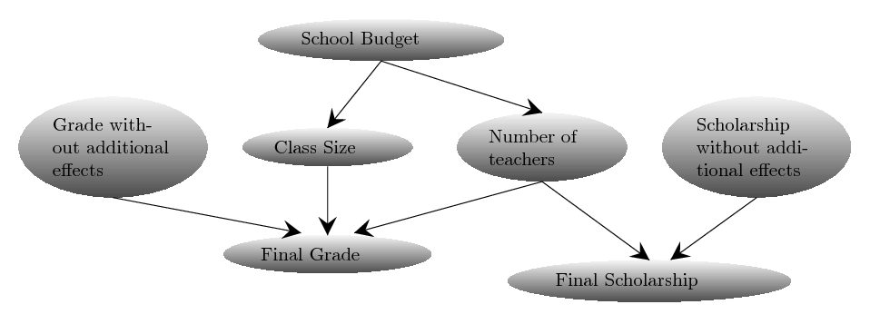

.. _gettingstarted:

2. Getting Started
==================

Here, we explain how to use ABCpy to quantify parameter uncertainty of a probabilistic model given some observed
dataset. If you are new to uncertainty quantification using Approximate Bayesian Computation (ABC), we recommend you to
start with the `Parameters as Random Variables`_ section.

Moreover, we also provide an interactive notebook on Binder guiding through the basics of ABC with ABCpy; without
installing that on your machine.
Please find it `here <https://mybinder.org/v2/gh/eth-cscs/abcpy/master?filepath=examples>`_.

Parameters as Random Variables
~~~~~~~~~~~~~~~~~~~~~~~~~~~~~~

As an example, if we have measurements of the height of a group of grown up humans and it is also known that a Gaussian
distribution is an appropriate probabilistic model for these kind of observations, then our observed dataset would be
measurement of heights and the probabilistic model would be Gaussian.

.. literalinclude:: ../../examples/extensions/models/gaussian_python/pmcabc_gaussian_model_simple.py
    :language: python
    :lines: 86-98, 103-105
    :dedent: 4

The Gaussian or Normal model has two parameters: the mean, denoted by :math:`\mu`, and the standard deviation, denoted
by :math:`\sigma`. We consider these parameters as random variables. The goal of ABC is to quantify the uncertainty of
these parameters from the information contained in the observed data.

In ABCpy, a :py:class:`abcpy.probabilisticmodels.ProbabilisticModel` object represents probabilistic relationship
between random variables or between random variables and observed data. Each of the :py:class:`ProbabilisticModel
<abcpy.probabilisticmodels.ProbabilisticModel>` object has a number of input parameters: they are either random
variables (output of another :py:class:`ProbabilisticModel <abcpy.probabilisticmodels.ProbabilisticModel>` object) or
constant values and considered known to the user (:py:class:`Hyperparameters
<abcpy.probabilisticmodels.Hyperparameters>`). If you are interested in implementing your own probabilistic model,
please check the :ref:`implementing a new model section <user_customization>`.

To define a parameter of a model as a random variable, you start by assigning a *prior* distribution on them. We can
utilize *prior* knowledge about these parameters as *prior* distribution. In the absence of prior knowledge, we still
need to provide *prior* information and a non-informative flat distribution on the parameter space can be used. The prior
distribution on the random variables are assigned by a probabilistic model which can take other random variables or hyper
parameters as input.

In our Gaussian example, providing prior information is quite simple. We know from experience that the average height
should be somewhere between 150cm and 200cm, while the standard deviation is around 5 to 25. In code, this would look as
follows:

.. literalinclude:: ../../examples/extensions/models/gaussian_python/pmcabc_gaussian_model_simple.py
    :language: python
    :lines: 99-105
    :dedent: 4

We have defined the parameter :math:`\mu` and :math:`\sigma` of the Gaussian model as random variables and assigned
Uniform prior distributions on them. The parameters of the prior distribution :math:`(150, 200, 5, 25)` are assumed to
be known to the user, hence they are called hyperparameters. Also, internally, the hyperparameters are converted to
:py:class:`Hyperparameter <abcpy.probabilisticmodels.HyperParameters>` objects. Note that you are also required to pass
a *name* string while defining a random variable. In the final output, you will see these names, together with the
relevant outputs corresponding to them.

For uncertainty quantification, we follow the philosophy of Bayesian inference. We are interested in the distribution of
the parameters we get after incorporating the information that is implicit in the observed dataset with the prior
information. This target distribution is called *posterior* distribution of the parameters. For inference, we draw
independent and identical sample values from the posterior distribution. These sampled values are called posterior
samples and used to either approximate the posterior distribution or to integrate in a Monte Carlo style w.r.t the
posterior distribution. The posterior samples are the ones you get as a result of applying an ABC inference scheme.

The heart of the ABC inferential algorithm is a measure of discrepancy between the observed dataset and the synthetic
dataset (simulated/generated from the model). Often, computation of discrepancy measure between the observed and
synthetic dataset is not feasible (e.g., high dimensionality of dataset, computationally to complex) and the discrepancy
measure is defined by computing a distance between relevant *summary statistics* extracted from the datasets. Here we
first define a way to extract *summary statistics* from the dataset.

.. literalinclude:: ../../examples/extensions/models/gaussian_python/pmcabc_gaussian_model_simple.py
    :language: python
    :lines: 107-109
    :dedent: 4

Next we define the discrepancy measure between the datasets, by defining a distance function (LogReg distance is chosen
here) between the extracted summary statistics. If we want to define the discrepancy measure through a distance function
between the datasets directly, we choose Identity as summary statistics which gives the original dataset as the
extracted summary statistics. This essentially means that the distance object automatically extracts the statistics from
the datasets, and then compute the distance between the two statistics.
 
.. literalinclude:: ../../examples/extensions/models/gaussian_python/pmcabc_gaussian_model_simple.py
    :language: python
    :lines: 111-113
    :dedent: 4

Algorithms in ABCpy often require a perturbation kernel, a tool to explore the parameter space. Here, we use the default
kernel provided, which explores the parameter space of random variables, by using e.g. a multivariate Gaussian
distribution or by performing a random walk depending on whether the  corresponding random variable is continuous or
discrete. For a more involved example, please consult `Composite Perturbation Kernels`_.

.. literalinclude:: ../../examples/extensions/models/gaussian_python/pmcabc_gaussian_model_simple.py
    :language: python
    :lines: 115-117
    :dedent: 4

Finally, we need to specify a backend that determines the parallelization framework to use. The example code here uses
the dummy backend :py:class:`BackendDummy <abcpy.backends.dummy>` which does not parallelize the computation of the
inference schemes, but which is handy for prototyping and testing. For more advanced parallelization backends
available in ABCpy, please consult :ref:`Using Parallelization Backends <parallelization>` section.

.. literalinclude:: ../../examples/extensions/models/gaussian_python/pmcabc_gaussian_model_simple.py
    :language: python
    :lines: 119-122
    :dedent: 4

In this example, we choose PMCABC algorithm (inference scheme) to draw posterior samples of the parameters. Therefore,
we instantiate a PMCABC object by passing the random variable corresponding to the observed dataset, the distance
function, backend object, perturbation kernel and a seed for the random number generator.

.. literalinclude:: ../../examples/extensions/models/gaussian_python/pmcabc_gaussian_model_simple.py
    :language: python
    :lines: 124-126
    :dedent: 4

Finally, we can parametrize the sampler and start sampling from the posterior distribution of the parameters given the
observed dataset:

.. literalinclude:: ../../examples/extensions/models/gaussian_python/pmcabc_gaussian_model_simple.py
    :language: python
    :lines: 128-131
    :dedent: 4

The above inference scheme gives us samples from the posterior distribution of the parameter of interest *height*
quantifying the uncertainty of the inferred parameter, which are stored in the journal object. See :ref:`Post Analysis
<postanalysis>` for further information on extracting results.

Note that the model and the observations are given as a list. This is due to the fact that in ABCpy, it is possible to
have hierarchical models, building relationships between co-occurring groups of datasets. To learn more, see the
`Hierarchical Model`_ section.

The full source can be found in `examples/extensions/models/gaussian_python/pmcabc_gaussian_model_simple.py`. To
execute the code you only need to run

::

   python3 pmcabc_gaussian_model_simple.py

Probabilistic Dependency between Random Variables
~~~~~~~~~~~~~~~~~~~~~~~~~~~~~~~~~~~~~~~~~~~~~~~~~

Since release 0.5.0 of ABCpy, a probabilistic dependency structures (e.g., a
Bayesian network) between random variables can be modelled. Behind the scene,
ABCpy will represent this dependency structure as a directed acyclic graph (DAG)
such that the inference can be done on the full graph. Further we can also
define new random variables through operations between existing random
variables. To make this concept more approachable, we now exemplify an inference
problem on a probabilistic dependency structure.

Students of a school took an exam and received some grade. The observed grades
of the students are:

.. literalinclude:: ../../examples/hierarchicalmodels/pmcabc_inference_on_multiple_sets_of_obs.py
    :language: python
    :lines: 29-42
    :dedent: 4

which depend on several variables: if there were bias, the average size of the
classes, as well as the number of teachers at the school. Here we assume the
average size of a class and the number of the teachers at the school are
normally distributed with some mean, depending on the budget of the school and
variance $1$. We further assume that the budget of the school is uniformly
distributed between 1 and 10 millions US dollars. Finally, we can assume that
the grade without any bias would be a normally distributed parameter around an
average grade. The dependency structure between these variables can be defined
using the following Bayesian network:

.. image:: network.png

We can define these random variables and the dependencies between them in ABCpy
in the following way:

.. literalinclude:: ../../examples/hierarchicalmodels/pmcabc_inference_on_multiple_sets_of_obs.py
    :language: python
    :lines: 46-47,50,53,56
    :dedent: 4

So, each student will receive some grade without additional effects which is
normally distributed, but then the final grade recieved will be a function of
grade without additional effects and the other random variables defined
beforehand (e.g., `school_budget`, `class_size` and `no_teacher`). The model for
the final grade of the students now can be written as:

.. literalinclude:: ../../examples/hierarchicalmodels/pmcabc_inference_on_multiple_sets_of_obs.py
    :language: python
    :lines: 59
    :dedent: 4

Notice here we created a new random variable `final_grade`, by subtracting the random variables `class_size` multiplied
by 0.001 and adding `no_teacher` multiplied by 0.02 from the random variable `grade_without_additional_effects`.
In short, this illustrates that you can perform standard operations "+",
"-", "*", "/" and "**" (the power operator in Python) on any two random variables, to get a new random variable. It is
possible to perform these operations between two random variables additionally to the general data types of Python
(integer, float, and so on) since they are converted to :py:class:`HyperParameters
<abcpy.probabilisticmodels.HyperParameters>`.

Please keep in mind that **parameters defined via operations will not be included in your list of parameters in the
journal file**. However, all parameters that are part of the operation, and are not fixed, will be included, so you can
easily perform the required operations on the final result to get these parameters, if necessary. In addition, you can
now also use the :code:`[]` operator (the access operator in Python). This allows you to select single values or ranges
of a multidimensional random variable as a parameter of a new random variable.

Hierarchical Model
~~~~~~~~~~~~~~~~~~

ABCpy also supports inference when co-occurring datasets are available. To illustrate how this is implemented, we
will consider the example from `Probabilistic Dependency between Random Variables`_ section and extend it for co-occurring datasets,
when we also have data for final scholarships given out by the school to the students in addition to the final grade of a student.

Whether a student gets a scholarship depends on the number of teachers in the school and on an independent score. Assuming the score is normally distributed, we can model the impact of the students social background on the scholarship as follows:

.. literalinclude:: ../../examples/hierarchicalmodels/pmcabc_inference_on_multiple_sets_of_obs.py
    :language: python
    :lines: 62-75, 78, 81
    :dedent: 4

With this we now have two *root* ProbabilisicModels (random variables), namely :code:`final_grade` and
:code:`final_scholarship`, whose output can directly compared to the observed datasets :code:`grade_obs` and
:code:`scholarship_obs`. With this we are able to do an inference computation on all free parameters of the hierarchical
model (of the DAG) given our observations.

To infer uncertainty of our parameters, we follow the same steps as in our previous examples: We choose summary
statistics, distance, inference scheme, backend and kernel. We will skip the definitions that have not changed from the
previous section. However, we would like to point out the difference in definition of the distance. Since we are now
considering two observed datasets, we need to define a distance on each one of them separately. Here, we use the Euclidean
distance for each observed data set and corresponding simulated dataset. You can use two different distances on two
different observed datasets.

.. literalinclude:: ../../examples/hierarchicalmodels/pmcabc_inference_on_multiple_sets_of_obs.py
    :language: python
    :lines: 83-91
    :dedent: 4

Using these two distance functions with the final code look as follows:

.. literalinclude:: ../../examples/hierarchicalmodels/pmcabc_inference_on_multiple_sets_of_obs.py
    :language: python
    :lines: 93-115
    :dedent: 4

Observe that the lists given to the sampler and the sampling method now contain two entries. These correspond to the two
different observed data sets respectively. Also notice now we provide two different distances corresponding to the two
different root models and their observed datasets. Presently ABCpy combines the distances by a linear combination, however
customized combination strategies can be implemented by the user.

The full source code can be found in `examples/hierarchicalmodels/pmcabc_inference_on_multiple_sets_of_obs.py`.

Composite Perturbation Kernels
~~~~~~~~~~~~~~~~~~~~~~~~~~~~~~

As pointed out earlier, it is possible to define composite perturbation kernels, perturbing different random variables in
different ways. Let us take the same example as in the `Hierarchical Model`_ and assume that we want to perturb the
schools budget, grade score and scholarship score without additional effect, using a multivariate normal kernel. However, the remaining
parameters we would like to perturb using a multivariate Student's-T kernel. This can be implemented as follows:

.. literalinclude:: ../../examples/extensions/perturbationkernels/pmcabc_perturbation_kernels.py
    :language: python
    :lines: 96-99
    :dedent: 4

We have now defined how each set of parameters is perturbed on its own. The sampler object, however, needs to be
provided with one single kernel. We, therefore, provide a class which groups the above kernels together. This class,
:py:class:`abcpy.perturbationkernel.JointPerturbationKernel`, knows how to perturb each set of parameters individually.
It just needs to be provided with all the relevant kernels:

.. literalinclude:: ../../examples/extensions/perturbationkernels/pmcabc_perturbation_kernels.py
    :language: python
    :lines: 101-103
    :dedent: 4

This is all that needs to be changed. The rest of the implementation works the exact same as in the previous example. If
you would like to implement your own perturbation kernel, please check :ref:`Implementing a new Perturbation Kernel
<user_customization>`. Please keep in mind that you can only perturb parameters. **You cannot use the access operator to
perturb one component of a multi-dimensional random variable differently than another component of the same variable.**

The source code to this section can be found in `examples/extensions/perturbationkernels/pmcabc_perturbation_kernels.py`

Inference Schemes
~~~~~~~~~~~~~~~~~

In ABCpy, we implement widely used and advanced variants of ABC inferential schemes:

* Rejection ABC :py:class:`abcpy.inferences.RejectionABC`,
* Population Monte Carlo ABC :py:class:`abcpy.inferences.PMCABC`,
* Two versions of Sequential Monte Carlo ABC :py:class:`abcpy.inferences.SMCABC`,
* Replenishment sequential Monte Carlo ABC (RSMC-ABC) :py:class:`abcpy.inferences.RSMCABC`,
* Adaptive population Monte Carlo ABC (APMC-ABC) :py:class:`abcpy.inferences.APMCABC`,
* ABC with subset simulation (ABCsubsim) :py:class:`abcpy.inferences.ABCsubsim`, and
* Simulated annealing ABC (SABC) :py:class:`abcpy.inferences.SABC`.

To perform ABC algorithms, we provide different the standard Euclidean distance function
(:py:class:`abcpy.distances.Euclidean`) as well as discrepancy measures between empirical datasets
(eg, achievable classification accuracy between two datasets

*  classification accuracy (:py:class:`abcpy.distances.LogReg`, :py:class:`abcpy.distances.PenLogReg`)
* :py:class:`abcpy.distances.Wasserstein`
* :py:class:`abcpy.distances.SlicedWasserstein`
* :py:class:`abcpy.distances.GammaDivergence`
* :py:class:`abcpy.distances.KLDivergence`
* :py:class:`abcpy.distances.MMD`
* :py:class:`abcpy.distances.EnergyDistance`
* :py:class:`abcpy.distances.SquaredHellingerDistance`.

We also have implemented the standard Metropolis-Hastings MCMC :py:class:`abcpy.inferences.MCMCMetropoliHastings` and population Monte Carlo :py:class:`abcpy.inferences.PMC` algorithm to infer parameters when
the likelihood or approximate likelihood function is available. For approximation of the likelihood function we provide
the following methods methods:

* Synthetic likelihood approximation :py:class:`abcpy.approx_lhd.SynLikelihood`,
* Semiparametric Synthetic likelihood :py:class:`abcpy.approx_lhd.SemiParametricSynLikelihood`, and another method using
* penalized logistic regression :py:class:`abcpy.approx_lhd.PenLogReg`.

Next we explain how we can use PMC algorithm using approximation of the
likelihood functions. As we are now considering two observed datasets
corresponding to two root models, we need to define an approximation of
likelihood function for each of them separately. Here, we use the
:py:class:`abcpy.approx_lhd.SynLikelihood` for each of the root models. It is
also possible to use two different approximate likelihoods for two different
root models.

.. literalinclude:: ../../examples/approx_lhd/pmc_hierarchical_models.py
    :language: python
    :lines: 78-86
    :dedent: 4

We then parametrize the sampler and sample from the posterior distribution. 

.. literalinclude:: ../../examples/approx_lhd/pmc_hierarchical_models.py
    :language: python
    :lines: 97-103
    :dedent: 4 

Observe that the lists given to the sampler and the sampling method now contain two entries. These correspond to the two
different observed data sets respectively. Also notice we now provide two different distances corresponding to the two
different root models and their observed datasets. Presently ABCpy combines the distances by a linear combination.
Further possibilities of combination will be made available in later versions of ABCpy.

The source code can be found in `examples/approx_lhd/pmc_hierarchical_models.py`.

For an example using MCMC instead of PMC, check out `examples/approx_lhd/mcmc_hierarchical_models.py`.

Statistics Learning
~~~~~~~~~~~~~~~~~~~

As we have discussed in the `Parameters as Random Variables`_ Section, the discrepancy measure between two datasets is
defined by a distance function between extracted summary statistics from the datasets. Hence, the ABC algorithms are
subjective to the summary statistics choice. This subjectivity can be avoided by a data-driven summary statistics choice
from the available summary statistics of the dataset. In ABCpy we provide several statistics learning procedures,
implemented in the subclasses of :py:class:`abcpy.statisticslearning.StatisticsLearning`, that generate a training
dataset of (parameter, sample) pairs and use it to learn a transformation of the data that will be used in the inference
step. The following techniques are available:

* Semiautomatic :py:class:`abcpy.statisticslearning.Semiautomatic`,
* SemiautomaticNN :py:class:`abcpy.statisticslearning.SemiautomaticNN`,
* ContrastiveDistanceLearning :py:class:`abcpy.statisticslearning.ContrastiveDistanceLearning`,
* TripletDistanceLearning :py:class:`abcpy.statisticslearning.TripletDistanceLearning`.

The first two build a transformation that approximates the parameter that generated the corresponding observation, the
first one by using a linear regression approach and the second one by using a neural network embedding. The other two
use instead neural networks to learn an embedding of the data so that the distance between the embeddings is close to
the distance between the parameter values that generated the data.

We remark that the techniques using neural networks require `Pytorch <https://pytorch.org/>`_ to be installed. As this is an optional feature,
however, Pytorch is not in the list of dependencies of ABCpy. Rather, when one of the neural network based routines is
called, ABCpy checks if Pytorch is present and, if not, asks the user to install it. Moreover, unless the user wants to
provide a specific form of neural network, the implementation of the neural network based ones do not require any
explicit neural network coding, handling all the necessary definitions and training internally.

It is also possible to provide a validation set to the neural network based training routines in order to monitor the
loss on fresh samples. This can be done for instance by set the parameter `n_samples_val` to a value larger than 0.
Moreover, it is possible to use the validation set for early stopping, ie stopping the training as soon as the loss on
the validation set starts increasing. You can do this by setting `early_stopping=True`. Please refer to the API documentation
(for instance :py:class:`abcpy.statisticslearning.SemiautomaticNN`) for further details.

We note finally that the statistics learning techniques can be applied after compute a first set of statistics; therefore,
the learned transformation will be a transformation applied to the original set of statistics.
For instance, consider our initial example from `Parameters as Random Variables`_ where we model the height of humans.
The original summary statistics were defined as follows:

.. literalinclude:: ../../examples/statisticslearning/pmcabc_gaussian_statistics_learning.py
    :language: python
    :lines: 52-54
    :dedent: 4

Then we can learn the optimized summary statistics from the above list of summary statistics using the semi-automatic
summary selection procedure as follows:

.. literalinclude:: ../../examples/statisticslearning/pmcabc_gaussian_statistics_learning.py
    :language: python
    :lines: 56-62
    :dedent: 4

We remark that the minimal amount of coding needed for using the neural network based regression does not change at all:

.. literalinclude:: ../../examples/statisticslearning/pmcabc_gaussian_statistics_learning.py
    :language: python
    :lines: 64-72
    :dedent: 4

And similarly for the other two approaches.

We can then perform the inference as before, but the distances will be computed on the newly learned summary statistics.

Model Selection
~~~~~~~~~~~~~~~

A further extension of the inferential problem is the selection of a model (M), given an observed
dataset, from a set of possible models. The package also includes a parallelized version of random 
forest ensemble model selection algorithm [:py:class:`abcpy.modelselections.RandomForest`].

Lets consider an array of two models `Normal` and `StudentT`. We want to find out which one of these two models are the
most suitable one for the observed dataset `y_obs`.

.. literalinclude:: ../../examples/modelselection/randomforest_modelselections.py
    :language: python
    :lines: 11-23
    :dedent: 4

We first need to initiate the Model Selection scheme, for which we need to define the summary statistics and backend:

.. literalinclude:: ../../examples/modelselection/randomforest_modelselections.py
    :language: python
    :lines: 25-34
    :dedent: 4

Now we can choose the most suitable model for the observed dataset `y_obs`,

.. literalinclude:: ../../examples/modelselection/randomforest_modelselections.py
    :language: python
    :lines: 36-37
    :dedent: 4

or compute posterior probability of each of the models given the observed dataset.

.. literalinclude:: ../../examples/modelselection/randomforest_modelselections.py
   :language: python
   :lines: 39-40
   :dedent: 4

Logging
~~~~~~~

Sometimes, when running inference schemes it is desired to have a more verbose
logging output. This can be achieved by using Python's standard logger and
setting it to info mode at the beginning of the file.

.. literalinclude:: ../../examples/extensions/models/gaussian_python/pmcabc_gaussian_model_simple.py
   :language: python
   :lines: 1, 85
   :dedent: 0
